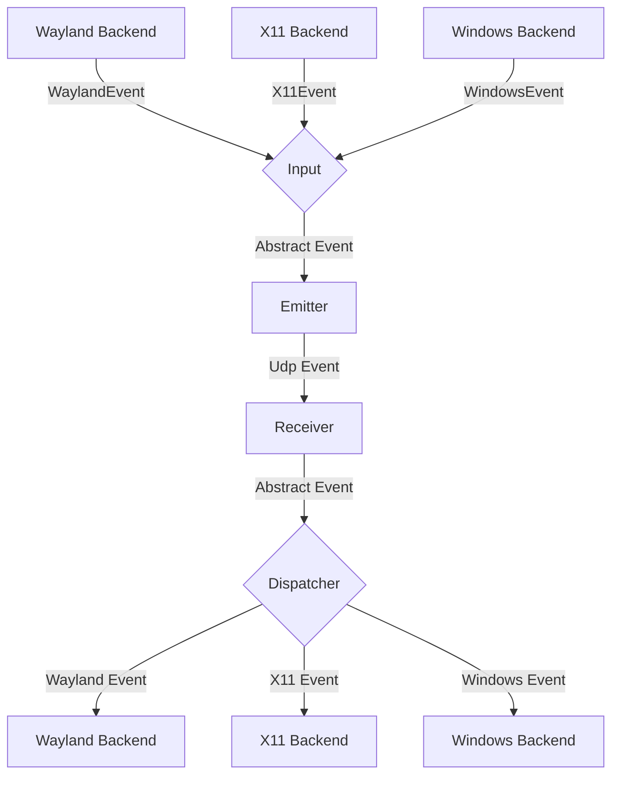
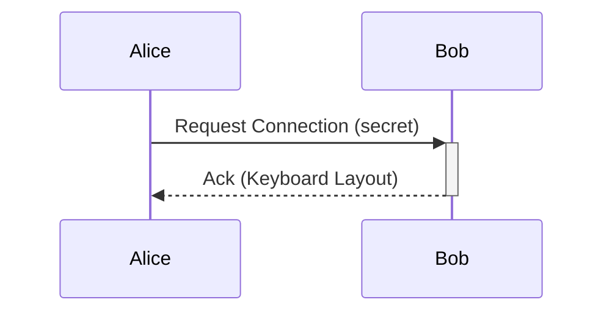

# General Software Architecture

## Events

Each instance of lan-mouse can emit and receive events, where
an event is either a mouse or keyboard event for now.

The general Architecture is shown in the following flow chart:

### Input
The input component is responsible for translating inputs from a given backend
to a standardized format and passing them to the event emitter.

### Emitter
The event emitter serializes events and sends them over the network
to the correct client.

### Receiver
The receiver receives events over the network and deserializes them into
the standardized event format.

### Dispatcher
The dispatcher component takes events from the event receiver and passes them
to the correct backend corresponding to the type of client. The libei backend
waits for socket writability and retries `WouldBlock` instead of failing. Keys
and buttons held for a client are released when that client is removed, with a
time limit per step so a backed up backend cannot block cleanup forever. The
Windows backend reports an event the operating system refuses to inject as an
error after a few attempts, instead of retrying it forever.

## Requests

// TODO this currently works differently

Aside from events, requests can be sent via a simple protocol.
For this, a simple tcp server is listening on the same port as the udp
event receiver and accepts requests for connecting to a device or to
request the keymap of a device.

## Problems
The general Idea is to have a bidirectional connection by default, meaning
any connected device can not only receive events but also send events back.

This way when connecting e.g. a PC to a Laptop, either device can be used
to control the other.

It needs to be ensured, that whenever a device is controlled the controlled
device does not transmit the events back to the original sender.
Otherwise events are multiplied and either one of the instances crashes.

To keep the implementation of input backends simple this needs to be handled
on the server level.

## Device State - Active and Inactive
To solve this problem, each device can be in exactly two states:

Either events are sent or received.

This ensures that
- a) Events can never result in a feedback loop.
- b) As soon as a virtual input enters another client, lan-mouse will stop receiving events,
which ensures clients can only be controlled directly and not indirectly through other clients.

## Input and frontend notification reliability

Both DTLS receive directions use `lan_mouse_proto::decode_event_frame` to decode
one application message at a time, including text and image clipboard frames.
A truncated clipboard message is rejected without reading another message as
its continuation. Existing compact and padded fixed-size frames remain accepted;
the wire event IDs and encoding are unchanged.

Input and clipboard send failures propagate to their callers. While clipboard
sharing is enabled, the service keeps one latest valid snapshot (up to 64 KiB)
and sends it when an authenticated transport becomes ready. Disconnected edits
replace that snapshot, so reconnection replays only the latest value. Receipt
of a remote write invalidates the prior snapshot immediately; only the current
successful OS write becomes replayable. Disabling sharing clears the snapshot
and pending receipts. This cache is in memory and does not survive service exit.

Clipboard reception uses a latest-value channel independent of input capture.
An authenticated incoming transport can share clipboard before an input Enter,
and outgoing sharing does not require a positive input-emulation heartbeat.
Target revisions and exact connection identity reject queued stale messages.
The source certificate fingerprint is excluded from forwarding over either route;
per-peer/session receipts avoid duplicate replay. Busy send queues retry the
latest snapshot at 250 ms intervals and rate-limit busy notices to two seconds.
Queue admission and complete network sends do not confirm the remote OS write;
simultaneous copies on different devices have no global conflict ordering.

Outgoing transport loss publishes an independent capture-close notice before
waiting for network cleanup. Capture drains these notices before processing
another input event, releases the current target without reconnecting to send
cleanup messages, clears pending modifiers and resets remapping state. Notices
coalesce to one per configured target and carry weak connection identity plus
target revision; a stale close cannot release a replacement or another target.
The heartbeat worker also performs current-session cleanup directly when it
ends, without relying on recv waking after close. Heartbeat sends have a
one-second deadline and reject incomplete sends. Ordinary input sends (including connection-table lookup) share a 250 ms deadline
and reject short writes. Failure retires only the captured session; transport
close runs independently of local pointer release. Capture shutdown cancels
in-flight sends. Local release happens before cleanup network traffic; all key
releases, zero modifiers and Leave share one 250 ms cleanup budget pinned to the
original transport and target revision. Cleanup never opens a new connection.
Input buffered after release or for another handle cannot send Enter without a
fresh Begin. An empty release key binding is disabled. These deadlines bound
network waits and are not an end-to-end latency measurement; native cursor
recovery still requires hardware tests.

Frontend notifications use an ordered writer per IPC connection, with a queue
of 64 messages and a two-second write deadline. Each JSON line is written in
full. A slow or failed frontend is disconnected so it cannot block the service's
input routing. The current GTK frontend still exits when its IPC connection
closes; automatic GUI reconnection is tracked in the review checklist.

The evdev backend retains fractional pointer movement per emulation handle,
clearing the remainder when that handle is destroyed. Default clipboard change
logs contain the content kind and size rather than the text preview.

See [the performance and UX review](docs/performance-ux-review.md) for remaining
issues and validation requirements.

Configuration saves write and sync a temporary file in the destination directory
before replacing the existing file. A failed write leaves the original file
intact and the watcher is restored even on failure. User-managed symlinks are
preserved by replacing their target; existing file permissions are retained.
Rename-based external updates are also detected by the config watcher.

On Windows, only a repeatable key-down changes the repeat target. Releasing
another key or pressing a modifier/lock key leaves the current repeat running.
Releasing the target, terminating, or dropping the backend stops its repeat task.

Remote clipboard updates use one serial writer outside the service event loop.
While a write is busy, only the latest pending clipboard snapshot is retained.
Received notifications follow successful platform writes; failed writes report
an error. Monitoring pauses feedback as soon as a remote snapshot is submitted,
including while it waits behind an active write or a full completion channel.
Each pending/active request owns a suppression lease; sampling resumes after all
leases end, and the cache is committed only on success. Disabling sharing discards pending snapshots; a platform write
that has already started is allowed to finish to preserve ordering.

Clipboard monitoring reuses platform access and compares dimensions and raw
pixels before re-encoding an unchanged image. The last raw image cache is bounded
to 64 MiB; larger images retain normal encoding and transfer-limit behavior.
Missed polling ticks are skipped, and dropping the monitor stops future polling.

Enter/leave hooks run serially outside the input loop, with at most 64 pending
commands. Normal submissions retain order. On overload, older pending commands
for the same device are replaced by its latest command and a warning is shown;
if the full queue belongs to other devices, the new command is rejected visibly.
Each command has a 30-second limit. Device deletion and service shutdown cancel
managed commands. Unix uses sh -c with a process group; Windows uses cmd.exe /C
without a console window and a Job Object. Existing Windows POSIX scripts should
explicitly invoke sh. Background programs launched by normally completed hooks
remain running, matching the previous behavior.

Client hostname and port edits are submitted after a 400 ms pause, or immediately
on Enter, focus leaving the entry, a DNS refresh, or window close. Draft values
remain visible while awaiting daemon confirmation, so stale state messages do
not replace ongoing edits. Invalid ports are marked and not submitted. Removing
a row discards its pending edit timers. Configuration writes are still performed
by the service; this edit debounce does not make disk persistence asynchronous.

Hostname lookups coalesce pending requests per device and use request revisions
independent of transport configuration changes. Deleting a device or changing
its hostname cancels the old async lookup and invalidates late results. Queries
report a failure after five seconds; failed refreshes retain known DNS addresses.
Native resolver calls share four process-wide slots. A slot remains held until
the blocking system call returns, even when its async wrapper is cancelled.
Running native resolver calls cannot be forcibly cancelled by dropping a future.

Outgoing connection attempts and sessions are cancelled when their target is
changed, deactivated, or deleted. A new target can start connecting without
waiting for the old handshake timeout. Attempt cleanup checks its own identity;
idle receivers also respond to cancellation. Hello and each connection close
have a one-second wait limit. Shutdown releases input capture/emulation before
waiting for outgoing connection and hook cleanup.

Incoming messages and cleanup are checked against their connection identity.
Replacing a connection at the same address cannot let an old receiver remove
or deliver messages to its replacement. Actual DTLS closure clears return-edge
and heartbeat metadata; a watchdog timeout on the same live connection retains
the existing Input/Ping recovery behavior. Listener shutdown cancels idle readers.
Connection-table access ends before certificate, send, or close awaits. These
lifecycle changes do not change the network wire format.

Windows capture uses an ordered queue of at most 256 events. When at least 32
are pending, adjacent motion for the same target can merge while retaining its
total displacement. Discrete events and target boundaries remain ordered. Hooks
do not wait for queue capacity; a short mutex protects queue operations. If the
queue cannot accept an event, hooks immediately return to local passthrough and
the daemon discards stale input, ends that target's transport/heartbeats, clears
mapping state, reports the failure, and disables capture. Explicitly re-enable
capture to start a fresh backend. Remote release follows disconnect or watchdog
cleanup; it is not guaranteed to arrive immediately on an unreliable network.

The Windows capture thread creates its message queue before reporting its thread
ID as ready, so the caller can immediately post the first configuration request.

GTK keeps its window open when the service disconnects or an IPC message cannot
be decoded. A visible status row reports disconnection/reconnection, clears old
connection state, and disables service controls until the new full Sync completes
(with its final Settings message). Connections and sends run on one cancellable
background worker; requests and notifications each have a 64-item queue. GUI
requests never wait for socket writes. Sends have a two-second limit; connection
attempts have a one-second limit and retry delays grow from 250 ms to five seconds.
Old connection generations and queued edits are discarded on reconnect. Rejected
hostname/port submissions retain an editable draft for explicit resubmission.
The Wayland window identifier is reapplied to the new service. Closing the app
allows accepted requests to drain for at most two seconds before the IPC worker
stops. This is a socket-send flush, not confirmation of configuration disk sync. The normal program entry point manages daemon startup;
the GTK UI no longer spawns an additional unmanaged daemon while waiting for IPC.

## Configuration reload

Deleting the final configured client persists an empty list. Reloading an
externally edited configuration applies clients, authorized fingerprints,
input mapping, scrolling, sensitivity, clipboard sharing and the listen-port
request without saving the previous runtime snapshot over that file. Clipboard
sharing can therefore also be disabled through the file while the service runs.
Watcher/read errors are reported to the frontend; the current configuration
remains in use and subsequent valid edits can still reload. This does not add
live switching of backend, certificate or key-repeat options. The service queues GUI saves on a serial blocking worker instead of waiting for
serialization, writes, fsync or rename in the input loop. One in-flight save and
one latest pending snapshot are retained; intermediate pending snapshots are
coalesced. Save completion is separate from external reload and cannot revert
newer runtime settings. Errors are reported asynchronously to the frontend.
`Config::changed` returns `Ok(true)` for an applied external edit and
`Ok(false)` for a successful background save or an unchanged read; its in-flight task survives
cancellation of the awaiting future. `queue_write_back` accepts a snapshot and
`flush` waits for all accepted snapshots or reports a failure. The blocking
`write_back` utility remains available, rejecting calls while a background save
runs or a read is in progress. Service reloads also read and parse on a retained
blocking task. Reads and saves do not run concurrently for a Config instance;
saves queued while reading wait for its result. The blocking `read_from_disk`
utility rejects calls while background I/O runs.

A file matching the committed byte baseline is an own-save notification and
cannot revert newer runtime edits. A genuinely changed external file replaces
pending snapshots based on the previous file. If this displaces edits queued
while reading, the service shows an error asking the user to review and retry;
the external snapshot and runtime reload are applied together. Invalid TOML or
read errors preserve runtime state and the old baseline, discard pending saves
and report failure; subsequent valid edits can reload. `flush` also waits for a
read when saves are queued behind it and reports any displaced pending edits.

Before saving, file bytes must match the last loaded/saved baseline. A second
check after syncing the temporary file catches edits during save preparation;
on conflict the original external file is kept and queued snapshots are dropped
until reload or a new explicit edit. This is best-effort conflict detection,
not an atomic compare-and-swap with third-party editors: an edit between the
final check and rename can still race. Comments from external edits remain on
reload; a later accepted GUI save still serializes the entire configuration.
The watcher callback is nonblocking; overflow retains a rescan flag and the
latest error. Normal shutdown releases input first, then allows up to two
seconds for config flush. On timeout the pending latest snapshot may not have
been persisted; the log explicitly reports unconfirmed disk completion. An
already running filesystem call cannot be forcibly cancelled.

Configuration paths are made absolute and their parent directory is canonicalized
before watcher registration, including `--config config.toml`. The service watches
both the configured file's directory and the canonical target directory of a
final symlink. Each background read refreshes that target watch before parsing
errors are reported, so retargeting to an invalid file does not prevent recovery.
Old target-directory watches are retired; an unwatch failure is logged and its
registration retained for a later retry. A dangling final symlink with an
existing target parent is preserved, and target-file creation triggers reload.
It is not populated with defaults. Intermediate symlink-chain retargets,
ancestor-directory alias retargets and creation of a missing target directory
are not covered by these watcher regressions.

Saving through a symlink also rechecks the resolved target after temp-file sync.
Retargeting during preparation rejects the save even if both files have identical
bytes. The remaining final-check-to-rename race with an uncoordinated external
editor is unchanged.

## Clipboard send feedback

Incoming-session clipboard sharing is reported after the network send completes,
rather than when its request is queued. Missing connections, encoding errors,
transport errors and incomplete sends produce a failure message while sharing is
enabled. A complete send produces the shared hint; completions after sharing is
disabled do not produce a stale success hint. Outgoing clipboard sends also
reject incomplete sends and disconnect only that target. Success means that the
local transport accepted the full encoded packet; this protocol has no remote
system-clipboard write acknowledgement. Incoming-session sends now use a separate 32-request ingress queue, four
independent send tasks and at most 32 latest-value pending peer slots. One send
per peer runs at a time, each with a two-second deadline. Pending values for the
same peer coalesce. Admission failure reports a retry hint. Requests retain the
connection captured at submission; replacement/disconnection cancels only stale
sessions. Disabling sharing cancels the generation, and completions from an old
generation are ignored even after re-enabling. Completion events retain only
payload kind/size, not its contents. Shutdown drops and aborts active tasks without
closing input connections just to cancel a clipboard send. Outgoing sends use a
second pool with the same four-task/32-pending-peer limits, submitted directly
without waiting for the connection table or network in service dispatch. They
capture the target revision and connection; target changes cancel queued work,
and failures clean up only the captured session asynchronously. Both pools share
the clipboard enable generation. Oversized local payloads are rejected before
cloning/encoding, and packet encoding runs inside send tasks. These limits bound
clipboard network work, not all process memory or input latency. Reconnect replay
and notification deduplication remain review work.

On Windows, watcher path matching treats ordinary and verbatim drive/UNC
prefixes as equivalent (`C:\...` / `\\?\C:\...` and UNC / verbatim UNC). It does
not fold file-name case or treat different drives/shares as the same file.

Generic watcher modification events (`Modify(Any)`, emitted by the Windows notify
backend) trigger a config read just like specific data/rename events. The injected
error-recovery fixture uses the registered canonical path, avoiding platform temp
path aliases; the separate actual notify test continues to check native delivery.

## Incoming control replies

Ack, Pong, Hello and cursor-return Leave replies run in an independent pool instead
of awaiting network sends in incoming input dispatch. Replies stay FIFO per peer;
they are not coalesced. There are at most four active sends, 128 pending packets
globally and 32 pending packets per peer. A one-second deadline starts at admission,
including time in the queue; expired packets are not sent later. Refused, short,
timed-out or overloaded replies remove only the captured current session, publish
its disconnect for local key/return-edge cleanup, and close it asynchronously.
A failure from an old session cannot remove its replacement. Replacements cancel
stale queued/active replies, and shutdown aborts the pool before listener cleanup.

These limits cover this reply pipeline. Listener input and emulation event channels
still need separate overload review. Real cross-machine return behavior and
complete-service latency remain acceptance work.

## Listening-port changes

Port requests use one latest-value slot rather than an unbounded request queue.
Binding and old-listener cleanup run as owned tasks while the existing listeners
continue accepting and incoming input dispatch continues. Binding has a two-second
deadline; old listeners close concurrently with a one-second deadline each. At most
one bind or cleanup batch runs at a time; a newer requested port remains in the
single pending slot. A successful obsolete bind is cleaned up without replacing
the active listeners or publishing success. Failed binding preserves the current
listeners, and choosing the running port also supersedes an unfinished request.
Installed-port results are delivered as events instead of awaiting in input dispatch.

Shutdown stops the emulation backend and releases its inputs before waiting for
listener cleanup. Listening sockets are closed explicitly; accepted connections
close concurrently. Binding/cleanup tasks are aborted when their owner is dropped.
These network deadlines are not a deadline for every OS backend shutdown operation.

## Ephemeral listening ports

A configured listening port of `0` asks the OS to choose an available port. The
first successfully bound address family selects it, and subsequent families use
that same port. Startup and port-change notifications report the actual nonzero
port so it can be entered on the peer. All installed listeners are checked for a
consistent nonzero port; invalid results are closed without replacing the running
listeners. Startup binding/address validation shares the two-second deadline used
for later changes.

The configuration keeps `0`, so a fresh process can choose a fresh port. Reloading
other settings with an unchanged configured port preserves the running port and
an existing temporary GUI port choice; it does not request another ephemeral
binding. An explicit GUI request for `0` chooses a new port. Bind failures retain
the running port and can be retried by explicitly requesting the port again.

## Clipboard monitor queue ordering

Local samples carry their monitor/write revision inside the bounded queue. The
public receive API still returns the same capture event, but discards queued
samples from older revisions, while disabled, or while a remote write is active.
A producer blocked by the full queue keeps the sample's original revision when
space becomes available. Disabling and re-enabling invalidates prior samples and
clears the local cache so the next fresh sample can establish the new scope.

Successful remote writes update the suppression cache and preserve unchanged raw
image reuse. Failed or abandoned writes preserve the last known content but mark
the completed revision for a fresh local observation; an older sample cannot clear
that refresh. Image reuse is reset when a fresh observation is needed. Publication
releases enabled/content/time/reader locks before waiting for queue capacity.

This handles queued samples across submitted remote writes and monitor toggles.
Replacing or clearing an unstarted request releases its suppression lease; an
active OS write retains its lease until completion. Dropping the writer prevents
its last unseen request from starting, while a write already in progress finishes.
Connection readiness/latest-value replay still requires service-level ordering
work. These changes do not retract a sample already delivered to its consumer.

## Authorization prompts

Unknown leaf certificate fingerprints are reported directly by certificate
verification, independently of input dispatch and later handshake errors. Pending
prompts are deduplicated and limited to 64 fingerprints; overflow retains the newest
requests. Recently delivered fingerprints expire after two seconds and are capped
at 128 entries. Delivery is limited to one prompt per 250 ms; repeated attempts do
not postpone the same fingerprint's next eligible prompt. Service checks current
authorization before notifying the frontend. These are application prompt limits,
not limits on DTLS library handshake state or every event queue.

Empty certificate chains return an authentication error. For a nonempty chain,
authorization uses the leaf fingerprint; an authorized intermediate does not grant
access to an unknown leaf. GTK keeps the current authorization prompt or description editor stable while
new requests wait in a deduplicated queue of at most 64 fingerprints. Canceling or
closing an interaction suppresses the same fingerprint locally for 30 seconds
(with at most 128 recent closures); authorization updates remove known requests.
After the current interaction closes, one coalesced idle opens the next prompt.
Manual fingerprint editing also prevents incoming prompts from interrupting it.

Description/fingerprint drafts stay open when the IPC request queue refuses a
submission. Closing after a successful submission means the worker accepted the
request; it does not acknowledge server authorization or disk persistence. Both
steps are tracked and closed on service disconnect, and old dialog callbacks
cannot submit into a new session. Prompts wait for daemon state synchronization.
Manual fingerprint format validation remains review work.

## Certificate fingerprint input

New GTK, CLI and raw IPC authorization requests validate the same SHA-256 input:
32 hexadecimal byte pairs separated by colons, or 64 continuous hexadecimal
digits. Uppercase and surrounding whitespace are accepted and normalized to
lowercase colon-separated bytes. Internal whitespace, wrong lengths, other
separators and non-hexadecimal characters are rejected. This parser does not
change the fingerprint hash or IPC event encoding.

The GTK editor shows an inline error and retains both drafts when validation
fails; correcting the field clears the error. CLI argument parsing rejects bad
input before connecting to the daemon. The service validates independently,
reports invalid input through the existing Error event, and does not save a
rejected authorization. Queue admission is still not a disk-write acknowledgement.
Runtime trust also normalizes the configuration's authorization keys at startup
and reload. Malformed keys are excluded from trust and the authorized-device list;
a bounded summary warning reports their count. Aliases for one digest are folded
together. If descriptions disagree, the exact canonical key wins; otherwise the
original keys are ordered lexicographically to choose a description. Conflicting
aliases produce a warning. Sync includes this warning for newly connected UIs.

Normalization does not write the file. Saving unrelated settings preserves the
original authorization keys and descriptions, including invalid entries and
aliases. Explicitly authorizing a digest replaces only that digest's aliases
with one canonical key. Removing a valid digest removes all of its aliases, so
reload cannot restore it; removing a malformed legacy key uses exact lookup.
Unrelated entries remain intact. These rules preserve the raw authorization table,
not file comments or formatting when a settings save serializes the configuration.

Revoking incoming authorization also detaches already accepted sessions and
cancels their readers and queued input, cursor warps, control replies and
clipboard work. Return barriers and incoming clipboard metadata are removed;
emulation cleanup releases tracked keys. Checks use the actual connection
identity, so old notifications cannot recreate a barrier or release a replacement
session. Idle readers are canceled without waiting for another input event.
Reauthorizing the same fingerprint requires a new handshake and does not revive
old session tokens. The handshake publication path rechecks current trust.

This applies to incoming certificate grants. Separately configured outgoing
targets retain their own activation policy. Already started native input or
clipboard calls cannot be undone; a successful clipboard write still updates
feedback suppression, but a revoked write cannot report success or become the
latest replay snapshot. Existing local clipboard contents are not erased.
Native backend stalls and complete-service latency remain acceptance work.

### Input backend operation deadlines

The emulation worker allows 500 ms for each asynchronous per-handle creation,
input delivery and cursor warp. A deadline returns an input error, runs the
existing bounded backend cleanup and disables emulation until explicitly enabled
again. The frontend receives the failure reason as well as the disabled status.
An uncertain input delivery is not automatically retried. Admitted incoming frames
add a stricter shared 50 ms deadline covering admission, queueing, handle creation
and delivery. Expiry cancels that session and invokes its bounded input cleanup;
it does not automatically disable an otherwise working backend. Partial handle creation
retains its address mapping so cleanup can reach the handle. Failed destruction
also retains that mapping for a subsequent Remove to retry the same handle.

Backend initialization that asks the user for desktop permission keeps its
existing termination path; it has no 500 ms approval deadline. Terminating during
handle reconstruction now exits after cleanup rather than entering the input
loop after its Terminate message was already consumed. These deadlines cover
futures that yield to the runtime. They cannot interrupt synchronous native calls
that block the runtime thread; native latency remains an acceptance requirement.

### Incoming input admission

Normal keyboard/pointer frames and Enter (cursor warp) share 256 outstanding
admission slots across the listener, with 64 slots per accepted connection.
Each slot follows its frame through the listener and emulation request queues
until backend processing or rejection ends. Forwarding alone does not free it.
A local 50 ms deadline starts before admission and follows the frame through
queueing, handle creation and delivery. Admission is bounded by the remaining
freshness time as well as its capacity deadline. Cancellation interrupts waits.
Already expired work never starts; expiry while delivering cancels the session,
reports an overload error once and invokes bounded key cleanup immediately.
Other sessions remain enabled. Stale messages from the canceled session cannot
affect a fresh connection at the same address. No frame encoding or normal FIFO
ordering changes. Idle readers do not reserve slots.

This bounds these application input frames, not every process queue. Clipboard,
protocol bookkeeping and connection lifecycle notifications retain their existing
paths; concurrent connection count and native resources require separate bounds.
The pinned DTLS dependency has a one-item decrypted application channel, but its
transport buffers are not included in this application budget. Bounded queue
length and a freshness deadline do not prove end-to-end latency: capture, network,
transport buffers, scheduling and synchronous native calls remain outside this
local yielding-operation guarantee. Native calls already started cannot be undone,
and failed cleanup retains state for retry. Complete-service latency and storm
tests remain required.

Enter uses the fingerprint recorded at the verified handshake, checked against
the exact connection identity and uncanceled session. It no longer rehashes a
certificate or waits on DTLS connection state in the input dispatcher.

### Native handle session ownership

Each accepted reader's input budget assigns an opaque connection identity.
Cloning that same reader's budget preserves its identity; accepting a replacement
always assigns a fresh identity, including at the same socket address. Input
leases carry it to the emulation worker, which stores only a weak identity beside
the native handle. No extra DTLS connection ownership or wire fields are added.

The worker may reuse a handle only within its owning session. Before a replacement
can create or deliver input, it retries bounded cleanup of the old handle. On
failure it cancels the replacement reader and reports an input cleanup error;
the old backend, handle identity and tracked state remain available for retry.
Other peers can continue submitting input. A later successful cleanup permits a
fresh native handle. Same-session Remove retries still reuse the retained handle,
and successful removal clears both the handle and its identity.

Ordinary backend delivery errors also cancel the failing reader before entering
the existing backend failure path, allowing the sender to release capture rather
than retain a live transport to disabled emulation. Native OS cleanup failures
and failed final termination remain separate acceptance requirements.

### Retained cleanup after backend failure

`InputEmulation::terminate_bounded()` returns an explicit completion result. Each
attempt has a one-second aggregate deadline and rotates the starting handle on
retry so early stalled peers cannot indefinitely starve later peers. Confirmed
key/button releases immediately leave the ledger; failed or canceled transitions
remain tracked. Repeating tasks stop before cleanup, while the backend transport
stays available until all tracked handles have been released and destroyed.
The existing unit-returning `terminate()` remains a compatibility wrapper.

After a fatal emulation error the worker retains the original backend instance.
Explicit reenable retries its cleanup before constructing a replacement; failure
keeps emulation disabled and reports why. Disconnect requests can still retry
individual retained handles while disabled. Worker shutdown transfers incomplete
cleanup to the service owner, whose repeated termination calls can retry it.
An incomplete final attempt returns `ServiceError::InputCleanupIncomplete` rather
than successful shutdown. No new wire fields or IPC event variants are added.

macOS repeat cancellation uses persistent task abort, including before the task
first runs; backend termination/drop also stops repeats. Windows repeat tasks
are stopped before retained cleanup as well. Already posted native events cannot
be undone by abort. The deadlines cover yielding operations; synchronous native
calls, ignored native close errors, forced process exit and task panics cannot
provide a guaranteed physical release or a durable cleanup ledger. Native
Windows/macOS/Linux fault recovery remains a separate acceptance requirement.

### Bounded key and button transitions

`input_event::Event::validate_transition()` checks that keyboard/button codes
belong to the bounded Linux EV_KEY namespace (`0..=0x2ff`, inclusive KEY_MAX)
and states are release (0) or press (1). Reserved in-range codes remain accepted;
this is a range bound, not a requirement to appear in the current key enum.
Motion, modifiers and clipboard payloads are outside this method's scope.

Incoming DTLS readers validate transitions before queue admission. An invalid
transition closes only that reader, cancels its queued input and follows normal
disconnect cleanup; the frontend receives an explanation through the existing
Error event. Other accepted connections remain available. Direct InputEmulation
consumers get `EmulationError::InvalidInput` before tracking or native delivery.
This prevents unbounded per-handle ledgers from distinct arbitrary u32 codes,
and prevents invalid codes/states from reaching native casts or keycode offsets.
Each handle's key and button ledgers can each hold at most 768 distinct codes.
The number of accepted connections/handles and other event queues still need
separate resource limits. Wire encoding and the protocol version are unchanged.

### Numeric pointer boundaries

`Event::validate_input()` extends transition validation with finite motion/scroll
values and vertical/horizontal axis validation (0/1). Readers call it before
queue admission; nonfinite Enter/Leave edge positions also close only that
reader. Direct InputEmulation calls reject invalid pointer input before native
delivery and verify the processed event as well. Direct nonfinite warp requests
are ignored before calling the native backend. The narrower
`validate_transition()` remains available with its original scope.

Sensitivity must be finite. A nonfinite value in a raw config reads as the
1.0 default; setters ignore it, and a service settings request reports an error
and republishes the current settings without saving the bad value. Direct backend
construction defaults to 1.0; an invalid backend config update preserves the
previous finite multiplier. Finite zero/negative/custom values retain their
existing semantics. Overflow during finite motion scaling saturates to finite
f64 limits. libei converts finite f64 motion/scroll to finite f32 limits.

Evdev emits saturated i32 motion when displacement is too large for its native
representation, discarding unrepresentable excess rather than carrying it into
future motion. Its residual always contains a finite fraction of at most 0.5;
invalid residuals reset, and a nonfinite direct quantizer delta emits no motion.
These defenses preserve ordinary fractional movement and axis independence.
Discrete scroll inversion and libei unit conversion use saturation at integer
boundaries; scroll accumulation uses i64 intermediates and retains the exact
sub-120 remainder. Extreme values can lose excess at native representation
limits, while subsequent ordinary input remains usable. These are source/logic
protections, not a claim that giant finite displacements are useful native input
or that physical device behavior has been verified on every OS.

### X11 button identity

X11 capture and emulation map left/middle/right buttons to native 1/2/3 and
back/forward to 8/9. Unsupported evdev buttons are ignored before XTest delivery;
they never fall back to a left click. Capture forwards the back/forward press
and release through the existing event path. The complete pipeline's overflow
and native delivery behavior still need target-OS acceptance.

Core X11 wheel presses 4/5/6/7 become vertical -120/+120 and horizontal
-120/+120 events; the matching release is ignored to avoid double scrolling.
Emulation accumulates AxisDiscrete120 to complete 120-unit wheel clicks, keeps
fractions and sign changes per handle and axis, and emits the actual click count.
Zero sends no clicks. Handle destruction/termination clears the residual state.
This follows the [Wayland 120-unit definition](https://wayland.freedesktop.org/docs/html/apa.html).

Core X11 only provides wheel clicks. Continuous Axis values are approximated by
10 logical units per click, following a [historic Wayland convention](https://cgit.freedesktop.org/wayland/wayland/commit/?id=c5356e9016aa814a873a765bb2cbe57e804e5ea7).
That heuristic retains fractions and reversals, but does not reproduce native
pixel/mm precision; touchpad feel still needs target-device verification.
Continuous and discrete residuals remain independent.

Large scroll deliveries yield before each batch of at most 32 complete native
press/release pairs. Each pair is flushed without an await in between; a canceled
operation does not keep replaying its undelivered clicks. This keeps yielding
work compatible with the existing input deadline, while synchronous Xlib calls
still cannot be preempted. Native delivery and capture-queue overload behavior
remain separate acceptance requirements.

### Native capture queue overload

X11 capture uses a bounded 64-event queue; Windows retains 256 events. After
32 queued events, adjacent motion for the same target can be coalesced without
crossing button/key/target boundaries. Queue locks cover only bounded queue
operations, never I/O or awaiting. If a discrete event cannot be admitted, the
queue latches a backend-specific overload error, discards stale events and stops
capture. X11 requests native pointer/keyboard ungrab and refuses another grab
with the failed queue. The service disables capture until explicitly re-enabled.

InputCapture prioritizes a latched native queue failure over its expanded fanout
cache. Already tracked pressed keys remain available for cleanup. This applies
to both Windows and X11. X11QueueOverloaded is an additive CaptureError variant;
wire encoding and protocol version are unchanged. Tests prove queue/state/error
behavior using release callbacks; synchronous native ungrab/flush success and
physical device recovery still require target-desktop verification.

### Fractional integer motion

X11 and Windows preserve relative-motion fractions per EmulationHandle using
the same quantizer as evdev. Rounding retains a finite residual of at most 0.5
per axis; slow input no longer disappears at every integer conversion. Creation,
destruction and termination reset the relevant lifecycle. Zero integer motion
skips native motion injection (X11's existing consume flush still runs).

Windows commits the next residual only after successful SendInput delivery.
X11 still does not inspect XTest return values; fractional conversion tests do
not establish native delivery success. Extreme output saturates to i32 and drops
unrepresentable excess. Wire encoding and protocol version are unchanged.

Evdev reverses vertical AxisDiscrete120 units with saturating negation. Ordinary
vertical direction and horizontal units are preserved. The positive equivalent
of i32::MIN is outside the native i32 representation and becomes i32::MAX,
losing one extreme unit instead of panicking or wrapping direction. Conversion
tests do not establish kernel/native delivery of enormous scroll values.

### X11 capture acquisition

X11 begins a capture session only after both XGrabPointer and XGrabKeyboard
return GrabSuccess. A keyboard refusal requests rollback through pointer/keyboard
ungrab and returns without warping, activating a client or publishing Begin.
A pointer refusal does not attempt keyboard acquisition. A later edge crossing
can retry a transient refusal. If both grabs succeed but Begin cannot enter the
bounded queue, the overload path requests release and disables capture.

State-machine tests use native-operation callbacks; actual Xlib release success,
blocking calls and physical keyboard/pointer recovery remain target-OS gates.

### X11 cursor return

X11 release_to(t) submits an internal return request. The capture thread moves
the pointer to the matching cross-axis position on the edge it left, inset by
up to 16 pixels, then requests pointer/keyboard ungrab. It seeds the next idle
edge check with that returned position. An inactive capture ignores repeated
return requests. Nonfinite t uses the midpoint; out-of-range t is clamped and
small/degenerate screen sizes bound the inset.

A closed request receiver returns BrokenPipe. Success now waits for the capture
thread to process the request and for its synchronous calls to return. This is
not acknowledgement of X server effects or verification of Xlib success. Tests
cover request processing and callback/state behavior, not physical pointer return.
X11 now fences its native queue before a new grab; the implementation and
remaining physical validation requirements are described below.

### X11 control and shutdown bounds

The control channel holds at most 16 requests. Creation of client edges,
destruction, release and cursor return wait asynchronously for admission and
thread processing within a combined 500ms deadline. Canceled requests are skipped
before processing; a timeout stops the backend rather than replaying late work.
Stopped capture refuses new controls and suppresses stale stream/fanout input.

Termination uses an independent stop flag, waits asynchronously up to 500ms,
and retains an unfinished thread handle for retry. Drop never waits for an
unfinished native worker. The worker owns final ungrab/display close and a
process-wide X11 worker lease; another X11 backend returns WorkerStillRunning
until that worker's cleanup finishes. Grab stages check stop before proceeding
and roll back late acquisition. The public creation error variant is additive;
wire encoding/protocol version do not change.

Native calls still cannot be interrupted by Tokio. Timeout reports incomplete
shutdown, and Drop may leave the stopped worker pending; its lease prevents
repeated X11 workers. Native success/error handling, physical cleanup and ordinary release/reentry
event isolation remain acceptance work. Initialization now uses the worker
and asynchronous deadline described below.

### X11 startup deadline

X11InputCapture::new is asynchronous; the backend factory awaits it. Opening
the display and querying its screen happen in the dedicated worker, with a
2-second readiness deadline on the calling runtime. Canceling or timing out
the wait requests stop; a late initializer cleans up rather than entering the
capture loop. Its worker lease remains held until that cleanup returns.

InitializationTimedOut, InitializationClosed and ThreadSpawn distinguish
startup timeout, missing initialization result and OS-thread creation failure;
OpenDisplayFailed remains the native open failure. A timeout cannot interrupt
Xlib opening/closing or prove physical cleanup. Startup regressions use controlled
initializers and real worker threads, not a stalled physical X server. Wire
encoding/protocol version are unchanged.

### Release/reentry input isolation

Public InputCapture release/release_to discard already expanded fanout before
awaiting the backend. They clear tracked keys only on successful release; errors
or cancellation retain that ledger for cleanup. X11 release also discards pending
handoff input without clearing an overload latch.

Before each new X11 grab, the worker calls XSync(display, True) to process prior
requests and discard their events, then acquires pointer/keyboard. It skips
preparation when already active and checks stop again before acquisition. Fresh
input after that boundary remains deliverable. This follows the
[X.Org XSync contract](https://xorg.freedesktop.org/archive/X11R7.5/doc/man/man3/XSync.3.html).

The boundary adds a native server wait per capture start, not per motion event.
Its real latency and X server failure behavior remain unverified. Callback tests
exercise state/ordering and a modeled native backlog; they do not establish
physical native queue cleanup. Other backends' ordinary native/handoff session
isolation remains separate work. Wire encoding and protocol version do not change.

### Native capture release errors

The root capture task snapshots the original transport and target configuration
revision before native release/release_to. On native error it cancels that original
target and schedules transport closure before returning the error, even after
the active handle has been taken. It does not send stale cleanup input on that
failed path. Identity/revision checks preserve replacement connections and other
clients; without a transport snapshot the original revision fences cancellation.

Transport closure runs in the existing bounded background close path. Contended
connection-table cleanup may remain pending, and these tasks do not establish a
global resource bound. Controlled result-stage failure tests establish routing
and cancellation behavior, not physical native or remote key release. Wire
encoding and protocol version remain unchanged.

Generic capture-session errors also snapshot transport identity and configuration
revision before awaiting native release. Successful native release then aborts
that saved session; failed native release already schedules the same cleanup.
The internal abort API schedules closure without awaiting transport close, so a
replacement created during native release is preserved. Controlled replacement
and stalled-close tests verify this decision stage; full native fault/recovery
and global pending-task bounds remain acceptance work.

### Unexpected capture stream closure

An input stream ending while capture is enabled now returns UnexpectedEof with
a backend-independent message. It follows the existing failure cleanup path:
release capture, clear active/remapping/modifier state, cancel the original
transport, and report CaptureFailed. Idle closure still reports failure without
canceling an unrelated connection. Explicit re-enable remains required after
backend failure; no reconnect loop is started.

When shutdown has already been requested, EOF remains successful. Service
shutdown separately terminates capture, emulation and connection senders. EOF
regressions use the production classification/finalization methods with a Dummy
backend and controlled transport; physical backend receiver closure and remote
key release remain unverified. Wire encoding and public APIs are unchanged.

### Capture exit error reporting

Each completed capture attempt reports its returned error once through
CaptureFailed, including backend creation, barrier creation and termination
errors. Service forwards this as a frontend Error; GTK displays that event as
a toast. Successful attempts emit no failure event. Existing disabled status
and explicit re-enable behavior remain in place.

If capture/barrier processing and backend termination both fail, the existing
Io(Other) error contains both messages. A single failure retains its original
error variant. There is no protocol or public variant addition.

Final failure reporting waits for backend termination to return. The shared
asynchronous cleanup timer described below can report pending progress before
that result; synchronous native blocking remains an acceptance issue.
Result-stage tests verify notification/content, not actual GUI display or
physical backend failure/cleanup.

### Pending asynchronous backend termination

While awaiting backend termination, capture sends one internal cleanup-pending
event after 250ms of asynchronous waiting. Service marks capture Disabled and
forwards a progress message using existing frontend event types. Immediate
completion emits no progress. Final returned errors still emit the separate
CaptureFailed message, including both processing and cleanup failures.

The feedback timer retains and polls the same cleanup future. It neither cancels
cleanup nor returns the attempt early, so re-enable cannot create a new backend
while that attempt is still awaiting termination. The retained owner is tested
with a controlled Drop guard; physical native cleanup is not proven.

This is not a native timeout. A synchronous call blocking the executor prevents
the timer from running. Whole-service shutdown may also stop consuming capture
events while awaiting termination. Fatal native release waits before termination
are now included in the shared chain below; ordinary release waits remain separate. The isolated Service fixture verifies status/message forwarding
with Dummy backends, not GTK rendering or physical backend recovery. Wire encoding
and public APIs are unchanged.

### Fatal capture release ordering

On a confirmed fatal capture-session error, the private AbortPeer release mode
requests cancellation of the saved transport/configuration generation before
polling native release. It clears local session state and sends ClientLeft, but
sends no stale cleanup input to the peer. A late native release error does not
repeat cancellation or resolve the handle to a replacement connection.

Normal release still restores the pointer before sending the bounded cleanup
batch. Send failure/disconnect paths keep their existing silent release behavior.
The same native release future is awaited; this ordering does not make native
release cancelable or prove physical key/pointer recovery. With a contended
connection table, cancellation waits for its lock and repeats identity checks.
A synchronous native call may prevent scheduled transport close from running.
Release-phase pending feedback remains separate from the termination timer.
Controlled native futures/transports verify this order; public APIs and wire
encoding are unchanged.

### Shared fatal release/termination progress

Fatal capture cleanup awaits one retained release/termination chain under the
same 250ms progress timer. A delayed native release can now produce the existing
cleanup-pending event; moving to termination does not emit a second progress
notice. Backend creation failures reuse that timer for their termination stage.
This does not alter AbortPeer cancellation ordering or return early to re-enable.

Final error text preserves the primary fault plus native-release and termination
failures, with stage labels. Multiple failures use existing Io(Other); a single
failure retains its type. Controlled chained futures and an owner Drop guard
verify sequencing and messages, not physical backend release.

Ordinary NotifyPeer/Silent releases are outside this fatal cleanup chain. Native
synchronous calls can still block the timer, and service shutdown can pause
frontend event consumption. Those recovery/feedback gates remain open. Wire
encoding and public APIs are unchanged.

### Incoming reader lifecycle limit

A LanMouseListener admits at most 32 application input readers in total across
its address families and port changes. The lease is reserved after authorization
and before session replacement or Accept publication. At capacity, the new
transport is closed without changing existing peers; retry after a reader exits.

Scheduled-but-unpolled readers, active reads and pending transport close all hold
a lease. Read-loop completion or task drop releases it. Replaced readers are
canceled and perform their own close; no duplicate replacement close task is
spawned. Task cancellation does not establish physical transport cleanup.

This bounds reader tasks and their receive buffers (roughly 2MiB at the current
64KiB protocol clipboard limit), not full service RSS. DTLS internal handshakes,
accept/event queues, queued transport references, identity retention and other
cleanup paths remain separate resource work. Excess-peer close may delay the
listener's accept/rebind loop by its existing one-second close deadline. Idle
reader retirement also remains under review; no idle timeout is added here.

Regressions include application admission/close ownership and 33 real local DTLS
connections with excess rejection and existing-peer Ping delivery. Wire encoding
and public APIs are unchanged.

### UDP session close and same-address reconnect

The locked webrtc-util 0.11.0 is vendored with a local close patch (see
vendor/webrtc-util/PATCHES.md). Closing an accepted UDP session removes only
that session from the listener table, wakes pending reads, and rejects later
sends. A reconnect from the same source address can create a fresh session;
repeating close on the old session cannot remove the replacement. The shared
listening socket remains available to other peers. Registration precedes
accept publication, with rollback when the pending accept queue is full.
UDP close discards queued packets and frees their backing allocation before
removing the table entry. Generic Buffer::close retains its draining behavior.
Canceled DTLS constructors retain cleanup ownership as described below.

### Raw UDP session receive backlog

Each accepted raw UDP session now holds at most 256 datagrams and 256KiB of
queued data including two-byte packet length headers (the backing ring can
allocate one additional slack byte). A full buffer drops new UDP datagrams
without waiting for a reader; draining restores capacity and preserves queued
FIFO. This reduces the original Buffer's 4MiB per-session allocation ceiling;
Each raw listener indexes at most 128 sessions; existing peers remain routable
at capacity and new peers above capacity are dropped. Queued sessions expire
after two seconds with a one-second sweep and a dequeue age check. Atomic
claim/expiry excludes accepted sessions. Closed buffers are freed before their
slots become reusable. This bounds indexed raw ring allocation, not aggregate
DTLS/cleanup resources or full-service RSS.
Overflow is lossy and high-rate hardware input/clipboard sharing needs manual
validation. Public signatures and DTLS wire encoding are unchanged.

### DTLS close notification errors

The locked DTLS dependency is vendored at webrtc-dtls 0.12.0 (see PATCHES.md).
Once close-notify returns, its error no longer skips reader shutdown and
underlying transport close. Single errors retain their original type; a double
failure reports both causes. Repeated close retains the original once-only
semantics. Close-wait cancellation is handled by the owned cleanup described below;
genuinely failed transport-close retry remains open. Global handshake/session bounds and
physical input recovery remain unverified. Public/wire signatures are unchanged.

### Canceling a DTLS close wait

DTLS close now retains one owned cleanup task per connection. Canceling a
caller wait (or dropping the DTLS object) does not cancel notification/worker/
transport cleanup. Concurrent calls wait for the same pending task. The first
completed waiter receives its result; later completed close calls return Ok.
A close notification has a 250ms best-effort deadline, followed by writer/reader
shutdown and the original raw transport close attempt. An interrupted outgoing
send cannot report successful completion merely because its result channel closed.
A raw close that never completes retains its cleanup owner: global task/resource
bounds and genuinely failed-close retry remain unverified. Failed/canceled
constructors use the guard described below. Synchronous stalls are not preempted by the async timer.

### Failed or canceled DTLS constructors

From its first poll, DTLSConn::new retains a handshake cleanup guard. On a
preflight/handshake error or cancellation, the guard schedules worker shutdown
and raw transport close; successful construction disarms it. Worker handles
are registered without an intervening await. The guard captures the runtime
handle so dropping the polled future on another thread still schedules cleanup
on the original live runtime. Runtime shutdown, never-polled futures, global
cleanup/session limits and genuinely failed raw close remain separate concerns.
Standalone vendored DTLS tests link the sibling UDP patch and run in Rust CI.

### Independent pending accepts

Pending accepts are retained per bound listener. Completion of another listener
or cancellation of a control-loop wait does not discard an in-flight handshake.
Only the completed listener is rearmed. The two-second handshake deadline now starts after underlying UDP acceptance;
idle waiting does not consume it. It does not guarantee all slow handshakes complete. Port replacement
and shutdown cancel the old accept pool before closing those listeners.
The pool retains one future per bound listener with no additional result queue;
underlying DTLS/session/cleanup global resource limits remain separate work.

### Handshake deadline start

Lan Mouse uses the vendored listen_with_handshake_timeout entry point with a
two-second duration. It bounds DTLS construction after raw UDP accept returns,
with ErrDeadlineExceeded on expiry and the constructor guard scheduling cleanup.
The original dependency listen/new signatures and untimed behavior remain.
Raw backlog waiting is outside this duration; slow/lossy real networks still
need validation. Wire encoding is unchanged.

### Closing a listener while peers remain connected

Closing a raw UDP/DTLS listener stops admission and wakes pending accepts, but
keeps dispatching packets for already accepted peers. Queued, unaccepted raw
sessions are retired when the close signal is observed. A final admission check
after the asynchronous accept filter prevents publication after closure.
The dispatch task exits once the accepted-session table is empty, checked at
packet processing and the one-second housekeeping tick. Accepted peers retain
the socket until they close; this preserves the documented DTLS contract during
port replacement. A listener close is not an instruction to disconnect peers.

### Incoming control and clipboard queue admission

Decoded frames outside ordinary keyboard/pointer input and Enter now retain
an independent queue lease in ListenEvent::Msg: at most 32 per peer and 128
shared across the LanMouseListener's peers/families/port replacements. Admission
waits at most 250ms and is cancellation-aware; exhaustion cancels/closes only
that session and reports the existing overload event. The lease remains held
while the listener queue or its dispatcher owns the message. Control frames do
not receive the 50ms input freshness deadline, and input queue permits remain
independent. Dropping/draining queued messages restores admission capacity.

The same lease now follows ClipboardReceived and PeerHello into the Service
queue and remains held until handling or rejection ends. Ping-triggered Entered
notifications share that ownership. Forwarding does not free a permit, and
dropping the queue frees retained permits. Leave-derived proxy Remove requests
now carry the same control lease through queueing and asynchronous cleanup;
Enter-derived ReleaseNotify/Entered notices and input-triggered Entered
recovery notices now share the original input reservation with the proxy.
Only the final owner releases its permits; sharing preserves the original
input deadline/cancellation and creates an Arc only for these derived notices.
Ordinary input retains directly owned permits. Connection-churn and other
lifecycle notifications still require further bounds. High-rate real-device
fairness and whole-service RSS are not established.

### Incoming reader generations retained by admission notices

The 32 incoming-reader slots now count a generation until its final reader,
Accept notice, Connected Service notice and admission-derived replacement
cleanup owner is released. ReaderLease shares one reservation; cloning owners
does not reserve additional slots. Completed readers cannot recycle slots while
these notices remain queued. Replacement cleanup retains the new admission's
reservation through proxy cleanup, and stale Accept/Connected rejection releases
its owner. The limit is shared across address families and port replacement.

Natural reader shutdown now transfers that reservation through Disconnected,
ConnectionClosed Service notices and proxy removal. An obsolete disconnect
discarded while a replacement is live releases only its old owner. This also
keeps a generation reserved after its stale Accept notice is rejected.
Control-reply failure and authorization revocation now retain the exact
generation through queued notifications and asynchronous close. Revocation
forwards that owner to ConnectionClosed and proxy cleanup. The lookup registry
uses weak references and connection identity checks, so it neither leaks slots
nor lends a replacement connection's reservation to an old completion. Reader
validation/admission-failure reports now retain the same generation through
Service processing. Proxy expiry and replacement-cleanup failure reports share
the original input reservation until Service processing/drop; sharing does not
renew freshness or create another permit. Repeated lifecycle work still needs
separate queue bounds.
It does not establish a total notification count or whole-service RSS bound.

### Watchdog work admission

Watchdog timeout work has a separate budget of 128 pending cycles globally and
4 per exact connection. A shared TimeoutLease remains owned by both the
Disconnected Service notice and proxy Remove through asynchronous cleanup, and
also retains the original reader generation. Ordinary input frames do not gain
new allocations from this budget. Once a peer's pending budget is full, its
reader token is canceled and one overload report follows the normal bounded
reader disconnect path; the dispatcher does not wait for queue capacity.
A replacement connection starts with a fresh peer counter but shares the global
limit. Service checks the timeout's exact connection before removing a return
edge, so a delayed old timeout cannot remove a replacement's registration.

This bounds watchdog cycles, not all backend status/re-enable/configuration
work or detached native cleanup tasks. The watchdog now waits for the nearest
one-second silence deadline using a reusable timer. Activity moves that peer's
deadline; expiry rearms for remaining peers, and no tracked peer disables the
timer branch. The five-second periodic scan is removed. Deadline readiness is
subject to executor and native-backend scheduling, so physical release and
full-pipeline RSS/latency remain separate acceptance work.

### Latest input settings through emulation queues

Scroll inversion and mouse sensitivity travel as one combined snapshot. Each
of the Service-to-dispatcher and dispatcher-to-proxy hops retains at most one
pending configuration marker; later edits update its shared value. The marker
keeps its queue position and input-frame order is preserved, while intermediate
settings snapshots are replaced by the latest value. After consumption/drop,
a subsequent change can enqueue a new marker. An unchanged first-hop setting
creates no work. Configuration forwarding is synchronous on the local runtime.

Backend and handle initialization waits now retain configuration requests
instead of discarding them while waiting for termination. Latest settings are
applied before the backend starts accepting input; failed initialization keeps
the desired configuration for recovery. This settings coalescing alone does not
bound release or other lifecycle sources, and does not change network serialization.

### Explicit emulation retry ownership

Repeated Emulation::reenable requests coalesce into one outstanding retry per
Emulation instance. Its shared ReenableLease crosses dispatcher/proxy queues,
the backend attempt and derived Enabled/Disabled/BackendFailed notices through
Service processing/drop. An active recovered backend keeps that attempt alive;
re-enable while active remains a no-op. Failed attempts remain reserved while
their feedback is pending; after the last owner drops a fresh explicit retry
can be submitted. There is no new automatic retry loop.

The weak producer registry does not keep attempts alive itself. Initial startup
has one finite status batch without a retry owner; subsequent explicit retry
cycles retain ownership instead of transferring backlog to status queues.
Cleanup refusal still prevents constructing a replacement backend. Release
requests, other feedback and detached native cleanup require separate
resource/physical recovery validation; this is not a total process RSS bound.

### Explicit capture retry ownership

Repeated Capture::reenable calls coalesce into one outstanding explicit retry
per Capture instance. A weak source registry tracks the shared CaptureRetryLease
through the queued request, backend initialization/active session, native cleanup,
and Enabled/Disabled/Failed/CleanupPending feedback until Service handles or drops
it. Holding a dequeued status still retains the attempt; a new explicit retry is
accepted after its final owner drops. Initial startup has one finite status batch
without this marker. Re-enable while active remains a no-op; no automatic retry
is introduced. The existing release/termination future stays owned while pending,
including after the single 250 ms progress notice. Coalescing does not timeout or
cancel native cleanup, nor prove bounded Release/configuration work or total RSS.

### Consecutive explicit capture releases

Consecutive Capture::release calls share one pending request until that request
is discarded while disabled or its native restoration and peer cleanup complete.
The producer stores only a Weak reference. Other submitted capture commands
(create/destroy, accepted re-enable and all settings updates) start a new release
group, preserving their FIFO boundaries: Release/Create/Release remains three
ordered operations. A held/dequeued release keeps its group's admission occupied.
The session loop cannot process a new capture while its release await is active.

ClientLeft hook feedback does not retain this admission after release completes:
a delayed hook report must not suppress a release for a later capture. This
coalescing bounds repeated releases within a group, not alternating lifecycle
commands, all feedback, detached cleanup work or total process memory. No native
release timeout or new cancellation behavior is introduced, and wire formats are
unchanged. Real platform restoration and release latency still need validation.

### Applying capture key-remap settings

Reapplying identical key/chord rules preserves the current held-key/chord state,
including pending chord modifiers and resolved override targets. Rule comparison
ignores session state. While capture is active, changing the rules first releases
that capture using the previous mapping, then installs the new rules. The pointer
returns locally through the existing release path; re-enter the peer to use the
new mapping. Inactive/disabled capture can install rules directly.

A release error still propagates into owned capture cleanup, with the new desired
rules retained for the next explicit recovery. This does not add native release
timeouts or auto retries. Configuration requests keep their FIFO boundaries and
are not globally bounded by this change. Physical hot reload and remote key
release on native backends still require platform verification.

### Coalescing capture settings

Release/jail binds, enter binds, key-remap rules and outgoing scroll inversion
share one pending settings marker per continuous update group. Further edits
replace their field in that marker; fields not edited are preserved. A source
keeps only a Weak reference. Accepted release/create/destroy/re-enable commands
end the group, so Settings/Release/Settings remains three ordered operations.
The first marker keeps its queue position; intermediate settings history and
its boundaries with native input events are replaced by the latest values.

The worker takes an immutable owned snapshot before awaiting remap release.
Its marker becomes empty at that point: edits received during cleanup enqueue
a fresh notification rather than silently modifying already-consumed settings.
Live application preserves the remap-state/release policy above and reapplies
enter binds to the backend; disabled capture saves the desired fields. A failed
remap release still saves the other desired fields before propagating failure.
This bounds continuous pending settings snapshots, not alternating lifecycle
commands, arbitrary settings payload sizes, native cleanup resources or total RSS.
Ordinary input delivery gets no additional allocation from this change.

### Retiring capture handles with cached events

InputCapture::destroy removes a registered handle's cached fanout events and all
logical routing/enter-only bookkeeping before its first native teardown await.
Events already expanded for other handles retain their order. A native teardown
error is still returned, but cannot leave the removed handle routable; logical
retirement does not prove native resources have been released. The capture task
retains its existing backend-error cleanup/termination behavior.

The service capture handler ignores events for unregistered handles before
changing release, jail or peer state. Valid events resolve position/type in one
lookup, including the outgoing opposite position. This prevents a late cached
Begin/Input for a deleted handle from triggering the former routing-lookup panic.
No protocol serialization changes are involved. Native disconnect/delete timing
and complete physical recovery remain platform validation work.

### Yielding during unroutable capture bursts

InputCapture consumes at most 32 unroutable native events in one poll_next call.
At that boundary it wakes its caller and returns Pending, allowing ready release,
configuration, disconnect and cancellation futures to be polled before the native
burst is fully drained. Missing positions and enter-only filtering share this
budget. Routable events and cached fanout still return immediately; no timer or
additional per-input allocation is introduced.

The continuation wake is needed even when a native backend stays ready without
another notification. Once the backend becomes pending, this path adds no repeated
idle wake. Physical pressed-key tracking remains incremental across batches.
The losing next() future can be canceled by a ready control branch without losing
later valid input. This is a routing work-count limit, not a wall-clock/native
poll latency guarantee; a synchronous backend poll can still block independently.

### Libei capture task completion

Libei stores capture-task completion state separately from is_finished. Stream
polling and termination consume the task result once, including an already-finished
task that has not yet been joined. Native CaptureError results remain unchanged;
Tokio panic/cancellation JoinError becomes an I/O CaptureError with task context
instead of causing a second panic in the capture handler. Repeated stream polls
are fused after completion, and termination after consumed completion succeeds
without polling the completed JoinHandle again.

Canceling a join wait leaves the original handle owned and its result unconsumed,
so later cleanup can await that same task. This adds no automatic retry or native
cleanup timeout. It preserves reporting and existing owned cleanup opportunities;
it does not prove portal/EIS resources or the physical pointer were restored after
a task fault. Real compositor suspend/restart and portal failure recovery need
platform validation.

### Libei client update batches

During the 50ms session-update debounce, client create/destroy notifications
update a separate desired-state snapshot containing at most four screen edges.
Duplicate notifications do not accumulate an operation history. Destroy/recreate
still moves that edge to the end, preserving barrier creation order. The running
session keeps its original clients until it closes; session cancellation, portal
restart behavior and the debounce duration are unchanged. This limits retained
client state and removes the later history replay, but does not bound notification
processing time, portal operations or total process memory.

### Libei session branch failures

Unexpected EIS stream errors now reach the capture owner with their original
CaptureError instead of being logged and converted to success. When the portal
activation branch finishes, including an early error, it cancels the waiting EIS
branch. At the outer session boundary, completion also cancels the waiting update
branch, covering failures during EIS connection, barrier setup and portal enable.
Both joins still await their branches before existing disable/close handling.

Requested EIS teardown takes priority over a simultaneously ready stream error,
so a normal session restart is not reported as an unexpected failure. This does
not add a native timeout or prove that a hung portal operation will finish; those
operations remain owned and must return before their completion can be reported.

### Libei update source closure

The session update watcher distinguishes zone-change signals from the end of
the signal stream. Unexpected zone-stream or client-notification channel closure
returns a contextual capture error before or during the 50ms debounce. It stops
polling that closed source and wakes the session branch through the existing
completion wrapper. Active sessions still reach existing disable/close handling
before that error is returned. Idle watcher errors also propagate to the owner.

Requested backend or session shutdown has priority over closed sources. The two
update sources retain fair selection, and a ready debounce timer takes priority
over further updates. The window is still measured from its first update. These
changes do not bound synchronous native polling or portal-operation time; native
fault recovery and physical pointer behavior need platform validation.

### Cooperative libei update bursts

The update watcher yields after every 32 processed notifications, counting both
zone signals and client changes. This gives the executor and joined control
branches a polling opportunity even when a source keeps returning ready changes.
The first update counts toward the first batch. Cancellation and the original
debounce deadline are checked again after continuation; yielding does not reset
that timer or discard the desired client snapshot. No extra per-event timer or
allocation is added. This is a work-count limit, not a native polling or physical
input-latency guarantee.

### Libei activation geometry fallback

When an activation lacks a usable barrier ID, the fallback selects the nearest
finite barrier segment. Distance projection is clamped to the segment endpoints,
so another monitor's collinear edge is not treated as an infinite matching line.
Squared distances use f64 and preserve fractional comparisons and integer barrier
endpoint precision. A zero-length segment is treated as a point; exact distance
ties retain the first configured barrier. Valid explicit barrier IDs still use
the existing direct lookup.

Empty fallback geometry or nonfinite cursor coordinates return a capture error
through the existing session cleanup path. Native barrier setup is unchanged.
Actual compositor and multi-monitor activation behavior needs platform testing.

### Portal barrier acceptance

The set_pointer_barriers response's failed IDs are removed from both the libei
geometry snapshot and its position routing map. Rejected edges cannot remain
fallback candidates. Partial acceptance retains the surviving barriers in their
original order and logs the rejected IDs and remaining count. Duplicate or unknown
failed IDs do not remove unrelated barriers.

If no barriers remain, including an empty requested geometry, setup returns a
capture error before enabling the session. Existing session completion and cleanup
handle that failure. Partial acceptance currently has a log warning rather than
a separate per-edge frontend status. Native rejection/reconfiguration and actual
physical pointer recovery still need platform validation.

### Libei activation session identity

Activated signals are checked against the current session's object path before
barrier lookup, cursor fallback or Begin emission. Signals from another session
are ignored even if their barrier ID matches a current one. They cannot select a
current edge or fail cursor fallback because their metadata is absent.

The expected path is cached once per capture session using ashpd Session's public
Serialize implementation, which serializes its object path. The library's path()
accessor is private; a typed zvariant object-path round trip avoids parsing Debug
output. Serialization errors return CaptureError through existing cleanup. The
activation check itself compares borrowed path strings without another marshal.
Zone-change session filtering is described below. Real portal session churn
and physical release behavior need platform tests.

### Optional libei activation cursor metadata

A known barrier ID can route an activation without cursor coordinates. Geometry
fallback requires coordinates and returns a contextual capture error when they
are absent; an inconsistent geometry-to-route map also reports an error. Supplied
nonfinite activation coordinates are rejected before Begin. Foreign-session
activations are still ignored before metadata validation.

Release always builds options carrying the received activation ID. When cursor
coordinates are missing or nonfinite, it omits the optional position suggestion
and still requests portal release. Finite coordinates use the owning region
projection and inward suggestion described below. This follows the portal's optional Release cursor_position
contract; the compositor controls the final pointer position. Native release placement remains for validation.

Specification: https://flatpak.github.io/xdg-desktop-portal/docs/doc-org.freedesktop.portal.InputCapture.html#org-freedesktop-portal-inputcapture-release

### Libei task resource ownership

The frontend and capture task share the InputCapture portal through Arc. Task
startup retains a strong owner until its capture future finishes, and do_capture
receives an owned Arc rather than a raw pointer. No portal pointer is cast or
dereferenced through unsafe. Arc keeps the existing Send capture interface while
the event task still runs on its LocalSet.

Dropping the frontend requests cancellation; dropping its JoinHandle detaches the
task rather than terminating it synchronously. The task retains the portal while
its async work or cleanup is pending. Canceling a join wait preserves that owner
and the original result. This changes resource lifetime safety, not native cleanup
timeouts: a stuck operation can still retain its resource, and actual portal
session closure/physical input restoration need validation.

### Libei release position after edge overshoot

Each accepted barrier retains its owning region bounds as internal metadata.
Release uses the reported barrier ID when it matches the selected route; unknown
or absent IDs choose the nearest barrier within that route. The finite cursor is
projected onto the barrier segment, moved one pixel inward, and clamped to the
owning region. This handles fast edge overshoot, corners, negative region offsets
and one-pixel zones. Axis-aligned projection preserves an in-range coordinate
without interpolation roundoff.

Without usable cursor or region geometry, Release omits its optional position
suggestion and keeps the activation ID. The compositor can ignore the suggestion;
unit coverage of serialized options does not prove physical pointer recovery.
No LAN protocol fields change. Geometry metadata is stored during configuration;
projection occurs on release rather than each input frame. Region arithmetic is checked as described below. Actual multi-machine switching
remains a separate validation item.

### Libei unused first-session cleanup

The initial session is created before any client becomes active. The capture task
now collects its normal or error result before returning and explicitly awaits
Close on that session if the active branch has not taken ownership. This covers
idle cancellation, update-source errors and signal-subscription setup errors.
A session consumed by the active branch keeps its existing disable/close path and
is not closed a second time by the finalizer. Close failures are logged without
replacing the original result, matching existing session cleanup behavior.

The finalizer retains the session while Close is pending. There is no new timeout
or abort; a stalled native Close can still delay completion. Controlled finalizer
tests do not establish real portal resource release, and panic/runtime shutdown
remain outside this normal/error return cleanup path.

### Libei event-channel shutdown

Begin and input sends report a contextual BrokenPipe capture error when the
frontend receiver closes rather than panicking. The existing session/EIS error
and sibling-cancellation paths can then finish before active-session disable and
Close. Begin delivery also races session cancellation, with requested shutdown
preferred when both are ready. A full one-event channel no longer prevents that
activation branch from observing cancellation; canceled Begin is not queued.

Normal Begin/input ordering and the channel capacity stay unchanged. EIS input
sends retain the outer run_ei_handler cancellation path. These changes do not add
per-event tasks or allocations on successful sends. Controlled channel/join tests
verify propagation and cooperation, not native compositor disable/Close success.

### Libei normalized entry position

Libei Begin now uses the activation cursor's cross-axis position within the owning
region rather than always reporting the midpoint. Known barrier IDs select their
own region; absent or unknown IDs reuse nearest-barrier lookup within the resolved
route. Left/right normalize Y and top/bottom normalize X, clamping overshoot to
0..=1. Negative offsets and fractional cursor positions are preserved. The full
logical region extent is used, consistent with exclusive bounds in X11/Windows
capture; one-pixel regions have a nonzero extent.

Absent/nonfinite cursor or missing geometry retains the midpoint fallback. Current
activation validation still rejects explicitly nonfinite coordinates before Begin.
The computed value flows through the existing cancellation-aware Begin send with
no protocol change. Receiver backends that cannot warp retain their existing
behavior; actual peer placement remains a platform validation item.

### Libei region coordinate validation

Region-to-barrier conversion rejects zero width/height and validates the owning
region's last-pixel coordinates and selected boundary against the portal's i32
coordinate range. Arithmetic uses i64 for the complete u32 dimension, avoiding
narrowing casts and intermediate i32 overflow. Large unsigned extents remain
accepted when their translated region and selected edge are representable.
Right/bottom retain their existing exclusive-edge placement.

The barrier factory and selection return CaptureError; update_barriers propagates
invalid geometry before SetPointerBarriers/Enable. Existing session cleanup then
handles setup failure. No input-frame work or serialized protocol fields change.
Tests decode actual ashpd Region/Zones data but do not establish that a live
compositor has supplied malformed regions. Barrier ID exhaustion is handled as described below.

### Libei activation-scoped input routing

The current route is published only after Begin has entered the capture channel.
Each activation owns a route guard and cancellation token. Ordinary release drops
the guard before awaiting portal Release; session cancellation/error exits also
drop it. This clears the matching route and cancels any input send still waiting
for channel capacity. A saved old route cannot send after its activation ends.
Replacing a route cancels the previous one; dropping an old guard cannot clear
the replacement because identity is checked.

Healthy inputs keep FIFO and closed-receiver error propagation. EIS handlers keep
a reference-counted route snapshot across send waits; route/token allocations
occur per activation rather than per input event. Cancellation does not withdraw
events already accepted into downstream queues. Native portal restoration and
physical cross-device behavior remain validation items.

### Libei barrier ID exhaustion

The capture task uses monotonically increasing nonzero barrier IDs. If the next
ID cannot be advanced, selection returns a contextual capture error instead of
panicking. It does not wrap or reset IDs within a running backend, which could
make a late activation refer to a newer barrier. The error propagates before
SetPointerBarriers/Enable through existing session cleanup. Re-enabling capture
creates a new backend/session.

Normal client/region order and sequential IDs are unchanged. Empty requests do
not consume IDs. Boundary tests start near u32::MAX; they do not establish that
an installed instance has exhausted its counter or caused a physical failure.

### Libei zone-change session scope

ZonesChanged signals match the currently running capture session's object path.
The path is cached before session setup and shared with the signal mapper; the
activation branch uses the same cached identity. After the joined branches finish,
the zone identity is cleared before disable/close. Idle operation ignores zone
signals because no active barrier session needs rebuilding; the next active setup
queries current zones.

Foreign signals are consumed as ignored updates rather than filtered inside a
stream poll loop. They do not start the 50ms debounce, but count toward the
32-update cooperative yield budget before and during debounce. A current signal
at that budget boundary also yields before more data is consumed. EOF/error and
client notification behavior remain unchanged. Tests cover typed signal decoding
and update helpers; real D-Bus session churn remains unverified.

### Libei token IO and event-loop progress

InputCapture restore-token reads and writes run on Tokio's blocking pool rather
than directly on the local async event thread. Read results keep their existing
trim/empty/missing behavior; writes retain private mode, parent creation and
replacement semantics. The write worker owns its token string. Worker join errors
become IO errors: reads fall back to no restore token, and save errors are logged
without failing an already-started portal session.

Controlled slow-operation tests establish that an async control task can progress
on the same runtime while the worker waits. Real temporary-file tests check read
behavior and 0600 write mode. They do not measure real storage latency, peer input
latency or total startup time. This adds blocking jobs per initialization/token
save, not per input frame. Started blocking work is not made cancelable or globally
bounded here; atomic persistence is described below and token-path handling
remains a separate item.

### Atomic InputCapture token replacement

Token saving creates a temporary file beside the destination, requires private
0600 permissions, writes the full value and syncs that file before persisting it
as the token path. Write/sync/rename errors preserve the previous destination;
normal error cleanup removes the temporary file. The old path is not truncated
or followed: an existing token symlink is replaced without changing its target.
This is an application-managed token file, unlike the configurable user config
symlink behavior.

Saving still runs in the blocking worker. If private permissions cannot be set,
saving reports an error rather than publishing a new token with wider access.
The portal session remains started and logs a save error. A previous token may
already have been consumed, so preserving its file does not guarantee future
consent-free startup. Parent-directory synchronization and power-loss durability
are not established here; real portal token rotation remains unverified.
