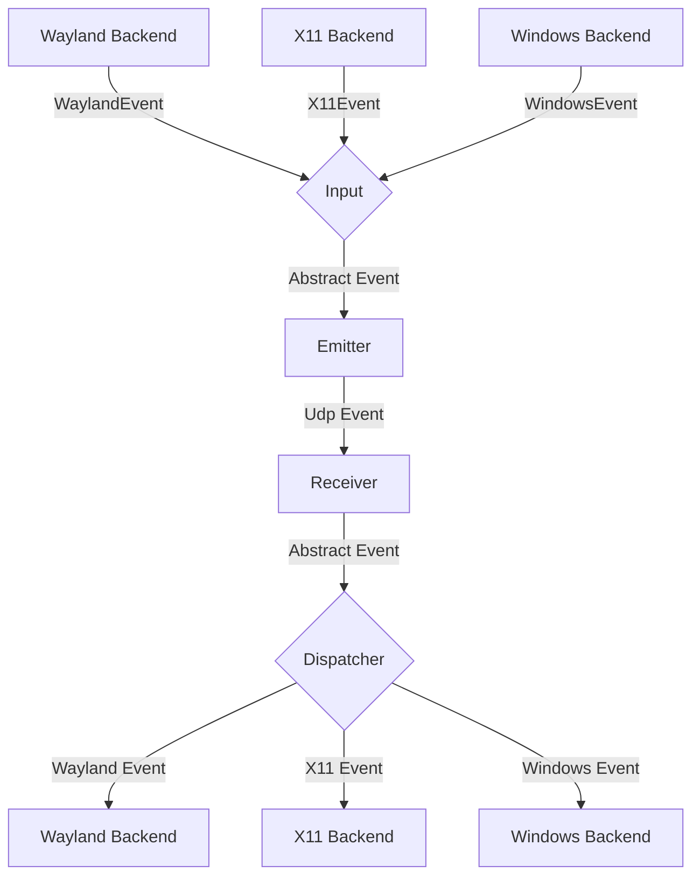
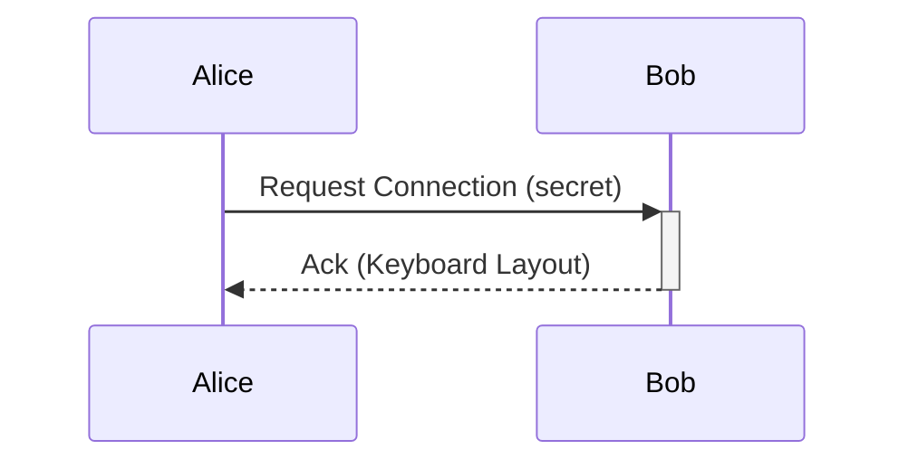

# General Software Architecture

## Events

Each instance of lan-mouse can emit and receive events, where
an event is either a mouse or keyboard event for now.

The general Architecture is shown in the following flow chart:

### Input
The input component is responsible for translating inputs from a given backend
to a standardized format and passing them to the event emitter.

### Emitter
The event emitter serializes events and sends them over the network
to the correct client.

### Receiver
The receiver receives events over the network and deserializes them into
the standardized event format.

### Dispatcher
The dispatcher component takes events from the event receiver and passes them
to the correct backend corresponding to the type of client. The libei backend
waits for socket writability and retries `WouldBlock` instead of failing. Keys
and buttons held for a client are released when that client is removed, with a
time limit per step so a backed up backend cannot block cleanup forever. The
Windows backend reports an event the operating system refuses to inject as an
error after a few attempts, instead of retrying it forever.

## Requests

// TODO this currently works differently

Aside from events, requests can be sent via a simple protocol.
For this, a simple tcp server is listening on the same port as the udp
event receiver and accepts requests for connecting to a device or to
request the keymap of a device.

## Problems
The general Idea is to have a bidirectional connection by default, meaning
any connected device can not only receive events but also send events back.

This way when connecting e.g. a PC to a Laptop, either device can be used
to control the other.

It needs to be ensured, that whenever a device is controlled the controlled
device does not transmit the events back to the original sender.
Otherwise events are multiplied and either one of the instances crashes.

To keep the implementation of input backends simple this needs to be handled
on the server level.

## Device State - Active and Inactive
To solve this problem, each device can be in exactly two states:

Either events are sent or received.

This ensures that
- a) Events can never result in a feedback loop.
- b) As soon as a virtual input enters another client, lan-mouse will stop receiving events,
which ensures clients can only be controlled directly and not indirectly through other clients.

## Input and frontend notification reliability

Both DTLS receive directions use `lan_mouse_proto::decode_event_frame` to decode
one application message at a time, including text and image clipboard frames.
A truncated clipboard message is rejected without reading another message as
its continuation. Existing compact and padded fixed-size frames remain accepted;
the wire event IDs and encoding are unchanged.

Input and clipboard send failures propagate to their callers. Clipboard sends
while disconnected return an error rather than reporting a successful transfer;
reconnect replay is not provided by this change.

Frontend notifications use an ordered writer per IPC connection, with a queue
of 64 messages and a two-second write deadline. Each JSON line is written in
full. A slow or failed frontend is disconnected so it cannot block the service's
input routing. The current GTK frontend still exits when its IPC connection
closes; automatic GUI reconnection is tracked in the review checklist.

The evdev backend retains fractional pointer movement per emulation handle,
clearing the remainder when that handle is destroyed. Default clipboard change
logs contain the content kind and size rather than the text preview.

See [the performance and UX review](docs/performance-ux-review.md) for remaining
issues and validation requirements.

Configuration saves write and sync a temporary file in the destination directory
before replacing the existing file. A failed write leaves the original file
intact and the watcher is restored even on failure. User-managed symlinks are
preserved by replacing their target; existing file permissions are retained.
Rename-based external updates are also detected by the config watcher.

On Windows, only a repeatable key-down changes the repeat target. Releasing
another key or pressing a modifier/lock key leaves the current repeat running.
Releasing the target, terminating, or dropping the backend stops its repeat task.
