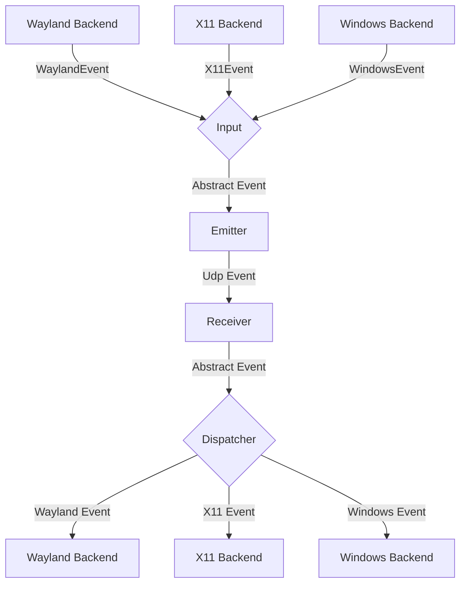
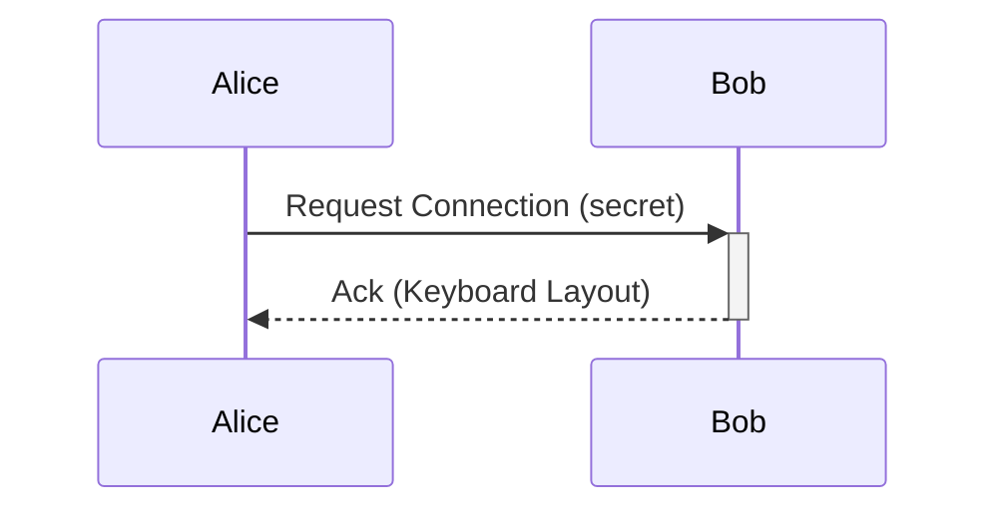

# General Software Architecture

## Events

Each instance of lan-mouse can emit and receive events, where
an event is either a mouse or keyboard event for now.

The general Architecture is shown in the following flow chart:

### Input
The input component is responsible for translating inputs from a given backend
to a standardized format and passing them to the event emitter.

### Emitter
The event emitter serializes events and sends them over the network
to the correct client.

### Receiver
The receiver receives events over the network and deserializes them into
the standardized event format.

### Dispatcher
The dispatcher component takes events from the event receiver and passes them
to the correct backend corresponding to the type of client. The libei backend
waits for socket writability and retries `WouldBlock` instead of failing. Keys
and buttons held for a client are released when that client is removed, with a
time limit per step so a backed up backend cannot block cleanup forever. The
Windows backend reports an event the operating system refuses to inject as an
error after a few attempts, instead of retrying it forever.

## Requests

// TODO this currently works differently

Aside from events, requests can be sent via a simple protocol.
For this, a simple tcp server is listening on the same port as the udp
event receiver and accepts requests for connecting to a device or to
request the keymap of a device.

## Problems
The general Idea is to have a bidirectional connection by default, meaning
any connected device can not only receive events but also send events back.

This way when connecting e.g. a PC to a Laptop, either device can be used
to control the other.

It needs to be ensured, that whenever a device is controlled the controlled
device does not transmit the events back to the original sender.
Otherwise events are multiplied and either one of the instances crashes.

To keep the implementation of input backends simple this needs to be handled
on the server level.

## Device State - Active and Inactive
To solve this problem, each device can be in exactly two states:

Either events are sent or received.

This ensures that
- a) Events can never result in a feedback loop.
- b) As soon as a virtual input enters another client, lan-mouse will stop receiving events,
which ensures clients can only be controlled directly and not indirectly through other clients.

## Input and frontend notification reliability

Both DTLS receive directions use `lan_mouse_proto::decode_event_frame` to decode
one application message at a time, including text and image clipboard frames.
A truncated clipboard message is rejected without reading another message as
its continuation. Existing compact and padded fixed-size frames remain accepted;
the wire event IDs and encoding are unchanged.

Input and clipboard send failures propagate to their callers. Clipboard sends
while disconnected return an error rather than reporting a successful transfer;
reconnect replay is not provided by this change.

Frontend notifications use an ordered writer per IPC connection, with a queue
of 64 messages and a two-second write deadline. Each JSON line is written in
full. A slow or failed frontend is disconnected so it cannot block the service's
input routing. The current GTK frontend still exits when its IPC connection
closes; automatic GUI reconnection is tracked in the review checklist.

The evdev backend retains fractional pointer movement per emulation handle,
clearing the remainder when that handle is destroyed. Default clipboard change
logs contain the content kind and size rather than the text preview.

See [the performance and UX review](docs/performance-ux-review.md) for remaining
issues and validation requirements.

Configuration saves write and sync a temporary file in the destination directory
before replacing the existing file. A failed write leaves the original file
intact and the watcher is restored even on failure. User-managed symlinks are
preserved by replacing their target; existing file permissions are retained.
Rename-based external updates are also detected by the config watcher.

On Windows, only a repeatable key-down changes the repeat target. Releasing
another key or pressing a modifier/lock key leaves the current repeat running.
Releasing the target, terminating, or dropping the backend stops its repeat task.

Remote clipboard updates use one serial writer outside the service event loop.
While a write is busy, only the latest pending clipboard snapshot is retained.
Received notifications follow successful platform writes; failed writes report
an error. Monitoring pauses feedback as soon as a remote snapshot is submitted,
including while it waits behind an active write or a full completion channel.
Each pending/active request owns a suppression lease; sampling resumes after all
leases end, and the cache is committed only on success. Disabling sharing discards pending snapshots; a platform write
that has already started is allowed to finish to preserve ordering.

Clipboard monitoring reuses platform access and compares dimensions and raw
pixels before re-encoding an unchanged image. The last raw image cache is bounded
to 64 MiB; larger images retain normal encoding and transfer-limit behavior.
Missed polling ticks are skipped, and dropping the monitor stops future polling.

Enter/leave hooks run serially outside the input loop, with at most 64 pending
commands. Normal submissions retain order. On overload, older pending commands
for the same device are replaced by its latest command and a warning is shown;
if the full queue belongs to other devices, the new command is rejected visibly.
Each command has a 30-second limit. Device deletion and service shutdown cancel
managed commands. Unix uses sh -c with a process group; Windows uses cmd.exe /C
without a console window and a Job Object. Existing Windows POSIX scripts should
explicitly invoke sh. Background programs launched by normally completed hooks
remain running, matching the previous behavior.

Client hostname and port edits are submitted after a 400 ms pause, or immediately
on Enter, focus leaving the entry, a DNS refresh, or window close. Draft values
remain visible while awaiting daemon confirmation, so stale state messages do
not replace ongoing edits. Invalid ports are marked and not submitted. Removing
a row discards its pending edit timers. Configuration writes are still performed
by the service; this edit debounce does not make disk persistence asynchronous.

Hostname lookups coalesce pending requests per device and use request revisions
independent of transport configuration changes. Deleting a device or changing
its hostname cancels the old async lookup and invalidates late results. Queries
report a failure after five seconds; failed refreshes retain known DNS addresses.
Native resolver calls share four process-wide slots. A slot remains held until
the blocking system call returns, even when its async wrapper is cancelled.
Running native resolver calls cannot be forcibly cancelled by dropping a future.

Outgoing connection attempts and sessions are cancelled when their target is
changed, deactivated, or deleted. A new target can start connecting without
waiting for the old handshake timeout. Attempt cleanup checks its own identity;
idle receivers also respond to cancellation. Hello and each connection close
have a one-second wait limit. Shutdown releases input capture/emulation before
waiting for outgoing connection and hook cleanup.

Incoming messages and cleanup are checked against their connection identity.
Replacing a connection at the same address cannot let an old receiver remove
or deliver messages to its replacement. Actual DTLS closure clears return-edge
and heartbeat metadata; a watchdog timeout on the same live connection retains
the existing Input/Ping recovery behavior. Listener shutdown cancels idle readers.
Connection-table access ends before certificate, send, or close awaits. These
lifecycle changes do not change the network wire format.

Windows capture uses an ordered queue of at most 256 events. When at least 32
are pending, adjacent motion for the same target can merge while retaining its
total displacement. Discrete events and target boundaries remain ordered. Hooks
do not wait for queue capacity; a short mutex protects queue operations. If the
queue cannot accept an event, hooks immediately return to local passthrough and
the daemon discards stale input, ends that target's transport/heartbeats, clears
mapping state, reports the failure, and disables capture. Explicitly re-enable
capture to start a fresh backend. Remote release follows disconnect or watchdog
cleanup; it is not guaranteed to arrive immediately on an unreliable network.

The Windows capture thread creates its message queue before reporting its thread
ID as ready, so the caller can immediately post the first configuration request.

GTK keeps its window open when the service disconnects or an IPC message cannot
be decoded. A visible status row reports disconnection/reconnection, clears old
connection state, and disables service controls until the new full Sync completes
(with its final Settings message). Connections and sends run on one cancellable
background worker; requests and notifications each have a 64-item queue. GUI
requests never wait for socket writes. Sends have a two-second limit; connection
attempts have a one-second limit and retry delays grow from 250 ms to five seconds.
Old connection generations and queued edits are discarded on reconnect. Rejected
hostname/port submissions retain an editable draft for explicit resubmission.
The Wayland window identifier is reapplied to the new service. Closing the app
allows accepted requests to drain for at most two seconds before the IPC worker
stops. This is a socket-send flush, not confirmation of configuration disk sync. The normal program entry point manages daemon startup;
the GTK UI no longer spawns an additional unmanaged daemon while waiting for IPC.

## Configuration reload

Deleting the final configured client persists an empty list. Reloading an
externally edited configuration applies clients, authorized fingerprints,
input mapping, scrolling, sensitivity, clipboard sharing and the listen-port
request without saving the previous runtime snapshot over that file. Clipboard
sharing can therefore also be disabled through the file while the service runs.
Watcher/read errors are reported to the frontend; the current configuration
remains in use and subsequent valid edits can still reload. This does not add
live switching of backend, certificate or key-repeat options. The service queues GUI saves on a serial blocking worker instead of waiting for
serialization, writes, fsync or rename in the input loop. One in-flight save and
one latest pending snapshot are retained; intermediate pending snapshots are
coalesced. Save completion is separate from external reload and cannot revert
newer runtime settings. Errors are reported asynchronously to the frontend.
`Config::changed` returns `Ok(true)` for an applied external edit and
`Ok(false)` for a successful background save or an unchanged read; its in-flight task survives
cancellation of the awaiting future. `queue_write_back` accepts a snapshot and
`flush` waits for all accepted snapshots or reports a failure. The blocking
`write_back` utility remains available, rejecting calls while a background save
runs or a read is in progress. Service reloads also read and parse on a retained
blocking task. Reads and saves do not run concurrently for a Config instance;
saves queued while reading wait for its result. The blocking `read_from_disk`
utility rejects calls while background I/O runs.

A file matching the committed byte baseline is an own-save notification and
cannot revert newer runtime edits. A genuinely changed external file replaces
pending snapshots based on the previous file. If this displaces edits queued
while reading, the service shows an error asking the user to review and retry;
the external snapshot and runtime reload are applied together. Invalid TOML or
read errors preserve runtime state and the old baseline, discard pending saves
and report failure; subsequent valid edits can reload. `flush` also waits for a
read when saves are queued behind it and reports any displaced pending edits.

Before saving, file bytes must match the last loaded/saved baseline. A second
check after syncing the temporary file catches edits during save preparation;
on conflict the original external file is kept and queued snapshots are dropped
until reload or a new explicit edit. This is best-effort conflict detection,
not an atomic compare-and-swap with third-party editors: an edit between the
final check and rename can still race. Comments from external edits remain on
reload; a later accepted GUI save still serializes the entire configuration.
The watcher callback is nonblocking; overflow retains a rescan flag and the
latest error. Normal shutdown releases input first, then allows up to two
seconds for config flush. On timeout the pending latest snapshot may not have
been persisted; the log explicitly reports unconfirmed disk completion. An
already running filesystem call cannot be forcibly cancelled.

Configuration paths are made absolute and their parent directory is canonicalized
before watcher registration, including `--config config.toml`. The service watches
both the configured file's directory and the canonical target directory of a
final symlink. Each background read refreshes that target watch before parsing
errors are reported, so retargeting to an invalid file does not prevent recovery.
Old target-directory watches are retired; an unwatch failure is logged and its
registration retained for a later retry. A dangling final symlink with an
existing target parent is preserved, and target-file creation triggers reload.
It is not populated with defaults. Intermediate symlink-chain retargets,
ancestor-directory alias retargets and creation of a missing target directory
are not covered by these watcher regressions.

Saving through a symlink also rechecks the resolved target after temp-file sync.
Retargeting during preparation rejects the save even if both files have identical
bytes. The remaining final-check-to-rename race with an uncoordinated external
editor is unchanged.

## Clipboard send feedback

Incoming-session clipboard sharing is reported after the network send completes,
rather than when its request is queued. Missing connections, encoding errors,
transport errors and incomplete sends produce a failure message while sharing is
enabled. A complete send produces the shared hint; completions after sharing is
disabled do not produce a stale success hint. Outgoing clipboard sends also
reject incomplete sends and disconnect only that target. Success means that the
local transport accepted the full encoded packet; this protocol has no remote
system-clipboard write acknowledgement. Incoming-session sends now use a separate 32-request ingress queue, four
independent send tasks and at most 32 latest-value pending peer slots. One send
per peer runs at a time, each with a two-second deadline. Pending values for the
same peer coalesce. Admission failure reports a retry hint. Requests retain the
connection captured at submission; replacement/disconnection cancels only stale
sessions. Disabling sharing cancels the generation, and completions from an old
generation are ignored even after re-enabling. Completion events retain only
payload kind/size, not its contents. Shutdown drops and aborts active tasks without
closing input connections just to cancel a clipboard send. Outgoing sends use a
second pool with the same four-task/32-pending-peer limits, submitted directly
without waiting for the connection table or network in service dispatch. They
capture the target revision and connection; target changes cancel queued work,
and failures clean up only the captured session asynchronously. Both pools share
the clipboard enable generation. Oversized local payloads are rejected before
cloning/encoding, and packet encoding runs inside send tasks. These limits bound
clipboard network work, not all process memory or input latency. Reconnect replay
and notification deduplication remain review work.

On Windows, watcher path matching treats ordinary and verbatim drive/UNC
prefixes as equivalent (`C:\...` / `\\?\C:\...` and UNC / verbatim UNC). It does
not fold file-name case or treat different drives/shares as the same file.

Generic watcher modification events (`Modify(Any)`, emitted by the Windows notify
backend) trigger a config read just like specific data/rename events. The injected
error-recovery fixture uses the registered canonical path, avoiding platform temp
path aliases; the separate actual notify test continues to check native delivery.

## Incoming control replies

Ack, Pong, Hello and cursor-return Leave replies run in an independent pool instead
of awaiting network sends in incoming input dispatch. Replies stay FIFO per peer;
they are not coalesced. There are at most four active sends, 128 pending packets
globally and 32 pending packets per peer. A one-second deadline starts at admission,
including time in the queue; expired packets are not sent later. Refused, short,
timed-out or overloaded replies remove only the captured current session, publish
its disconnect for local key/return-edge cleanup, and close it asynchronously.
A failure from an old session cannot remove its replacement. Replacements cancel
stale queued/active replies, and shutdown aborts the pool before listener cleanup.

These limits cover this reply pipeline. Listener input and emulation event channels
still need separate overload review. Real cross-machine return behavior and
complete-service latency remain acceptance work.

## Listening-port changes

Port requests use one latest-value slot rather than an unbounded request queue.
Binding and old-listener cleanup run as owned tasks while the existing listeners
continue accepting and incoming input dispatch continues. Binding has a two-second
deadline; old listeners close concurrently with a one-second deadline each. At most
one bind or cleanup batch runs at a time; a newer requested port remains in the
single pending slot. A successful obsolete bind is cleaned up without replacing
the active listeners or publishing success. Failed binding preserves the current
listeners, and choosing the running port also supersedes an unfinished request.
Installed-port results are delivered as events instead of awaiting in input dispatch.

Shutdown stops the emulation backend and releases its inputs before waiting for
listener cleanup. Listening sockets are closed explicitly; accepted connections
close concurrently. Binding/cleanup tasks are aborted when their owner is dropped.
These network deadlines are not a deadline for every OS backend shutdown operation.

## Ephemeral listening ports

A configured listening port of `0` asks the OS to choose an available port. The
first successfully bound address family selects it, and subsequent families use
that same port. Startup and port-change notifications report the actual nonzero
port so it can be entered on the peer. All installed listeners are checked for a
consistent nonzero port; invalid results are closed without replacing the running
listeners. Startup binding/address validation shares the two-second deadline used
for later changes.

The configuration keeps `0`, so a fresh process can choose a fresh port. Reloading
other settings with an unchanged configured port preserves the running port and
an existing temporary GUI port choice; it does not request another ephemeral
binding. An explicit GUI request for `0` chooses a new port. Bind failures retain
the running port and can be retried by explicitly requesting the port again.

## Clipboard monitor queue ordering

Local samples carry their monitor/write revision inside the bounded queue. The
public receive API still returns the same capture event, but discards queued
samples from older revisions, while disabled, or while a remote write is active.
A producer blocked by the full queue keeps the sample's original revision when
space becomes available. Disabling and re-enabling invalidates prior samples and
clears the local cache so the next fresh sample can establish the new scope.

Successful remote writes update the suppression cache and preserve unchanged raw
image reuse. Failed or abandoned writes preserve the last known content but mark
the completed revision for a fresh local observation; an older sample cannot clear
that refresh. Image reuse is reset when a fresh observation is needed. Publication
releases enabled/content/time/reader locks before waiting for queue capacity.

This handles queued samples across submitted remote writes and monitor toggles.
Replacing or clearing an unstarted request releases its suppression lease; an
active OS write retains its lease until completion. Dropping the writer prevents
its last unseen request from starting, while a write already in progress finishes.
Connection readiness/latest-value replay still requires service-level ordering
work. These changes do not retract a sample already delivered to its consumer.

## Authorization prompts

Unknown leaf certificate fingerprints are reported directly by certificate
verification, independently of input dispatch and later handshake errors. Pending
prompts are deduplicated and limited to 64 fingerprints; overflow retains the newest
requests. Recently delivered fingerprints expire after two seconds and are capped
at 128 entries. Delivery is limited to one prompt per 250 ms; repeated attempts do
not postpone the same fingerprint's next eligible prompt. Service checks current
authorization before notifying the frontend. These are application prompt limits,
not limits on DTLS library handshake state or every event queue.

Empty certificate chains return an authentication error. For a nonempty chain,
authorization uses the leaf fingerprint; an authorized intermediate does not grant
access to an unknown leaf. GTK keeps the current authorization prompt or description editor stable while
new requests wait in a deduplicated queue of at most 64 fingerprints. Canceling or
closing an interaction suppresses the same fingerprint locally for 30 seconds
(with at most 128 recent closures); authorization updates remove known requests.
After the current interaction closes, one coalesced idle opens the next prompt.
Manual fingerprint editing also prevents incoming prompts from interrupting it.

Description/fingerprint drafts stay open when the IPC request queue refuses a
submission. Closing after a successful submission means the worker accepted the
request; it does not acknowledge server authorization or disk persistence. Both
steps are tracked and closed on service disconnect, and old dialog callbacks
cannot submit into a new session. Prompts wait for daemon state synchronization.
Manual fingerprint format validation remains review work.
