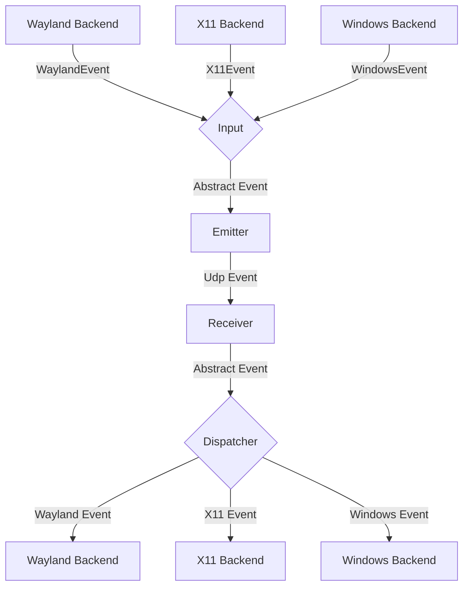
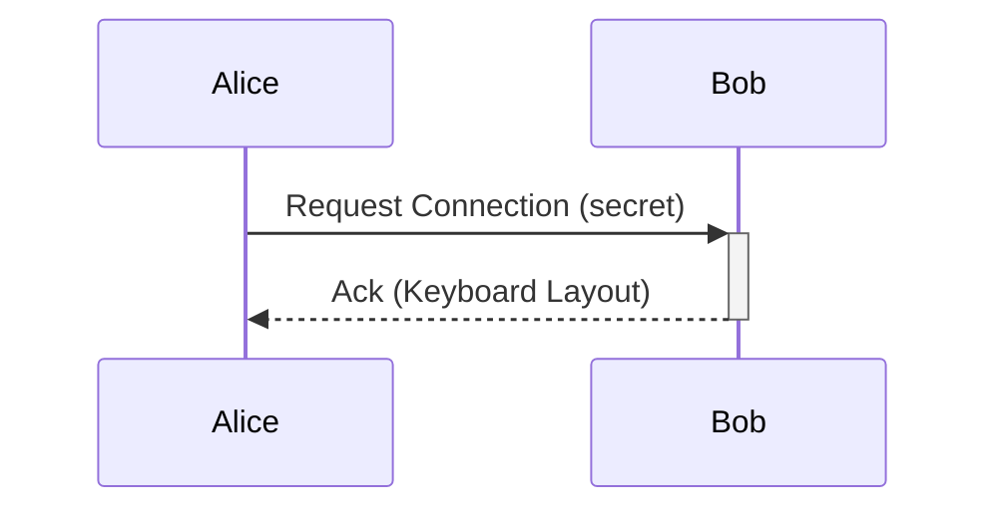

# General Software Architecture

## Events

Each instance of lan-mouse can emit and receive events, where
an event is either a mouse or keyboard event for now.

The general Architecture is shown in the following flow chart:

### Input
The input component is responsible for translating inputs from a given backend
to a standardized format and passing them to the event emitter.

### Emitter
The event emitter serializes events and sends them over the network
to the correct client.

### Receiver
The receiver receives events over the network and deserializes them into
the standardized event format.

### Dispatcher
The dispatcher component takes events from the event receiver and passes them
to the correct backend corresponding to the type of client. The libei backend
waits for socket writability and retries `WouldBlock` instead of failing. Keys
and buttons held for a client are released when that client is removed, with a
time limit per step so a backed up backend cannot block cleanup forever. The
Windows backend reports an event the operating system refuses to inject as an
error after a few attempts, instead of retrying it forever.

## Requests

// TODO this currently works differently

Aside from events, requests can be sent via a simple protocol.
For this, a simple tcp server is listening on the same port as the udp
event receiver and accepts requests for connecting to a device or to
request the keymap of a device.

## Problems
The general Idea is to have a bidirectional connection by default, meaning
any connected device can not only receive events but also send events back.

This way when connecting e.g. a PC to a Laptop, either device can be used
to control the other.

It needs to be ensured, that whenever a device is controlled the controlled
device does not transmit the events back to the original sender.
Otherwise events are multiplied and either one of the instances crashes.

To keep the implementation of input backends simple this needs to be handled
on the server level.

## Device State - Active and Inactive
To solve this problem, each device can be in exactly two states:

Either events are sent or received.

This ensures that
- a) Events can never result in a feedback loop.
- b) As soon as a virtual input enters another client, lan-mouse will stop receiving events,
which ensures clients can only be controlled directly and not indirectly through other clients.

## Input and frontend notification reliability

Both DTLS receive directions use `lan_mouse_proto::decode_event_frame` to decode
one application message at a time, including text and image clipboard frames.
A truncated clipboard message is rejected without reading another message as
its continuation. Existing compact and padded fixed-size frames remain accepted;
the wire event IDs and encoding are unchanged.

Input and clipboard send failures propagate to their callers. Clipboard sends
while disconnected return an error rather than reporting a successful transfer;
reconnect replay is not provided by this change.

Frontend notifications use an ordered writer per IPC connection, with a queue
of 64 messages and a two-second write deadline. Each JSON line is written in
full. A slow or failed frontend is disconnected so it cannot block the service's
input routing. The current GTK frontend still exits when its IPC connection
closes; automatic GUI reconnection is tracked in the review checklist.

The evdev backend retains fractional pointer movement per emulation handle,
clearing the remainder when that handle is destroyed. Default clipboard change
logs contain the content kind and size rather than the text preview.

See [the performance and UX review](docs/performance-ux-review.md) for remaining
issues and validation requirements.

Configuration saves write and sync a temporary file in the destination directory
before replacing the existing file. A failed write leaves the original file
intact and the watcher is restored even on failure. User-managed symlinks are
preserved by replacing their target; existing file permissions are retained.
Rename-based external updates are also detected by the config watcher.

On Windows, only a repeatable key-down changes the repeat target. Releasing
another key or pressing a modifier/lock key leaves the current repeat running.
Releasing the target, terminating, or dropping the backend stops its repeat task.

Remote clipboard updates use one serial writer outside the service event loop.
While a write is busy, only the latest pending clipboard snapshot is retained.
Received notifications follow successful platform writes; failed writes report
an error. Monitoring pauses feedback during a remote write and commits its cache
only on success. Disabling sharing discards pending snapshots; a platform write
that has already started is allowed to finish to preserve ordering.

Clipboard monitoring reuses platform access and compares dimensions and raw
pixels before re-encoding an unchanged image. The last raw image cache is bounded
to 64 MiB; larger images retain normal encoding and transfer-limit behavior.
Missed polling ticks are skipped, and dropping the monitor stops future polling.

Enter/leave hooks run serially outside the input loop, with at most 64 pending
commands. Normal submissions retain order. On overload, older pending commands
for the same device are replaced by its latest command and a warning is shown;
if the full queue belongs to other devices, the new command is rejected visibly.
Each command has a 30-second limit. Device deletion and service shutdown cancel
managed commands. Unix uses sh -c with a process group; Windows uses cmd.exe /C
without a console window and a Job Object. Existing Windows POSIX scripts should
explicitly invoke sh. Background programs launched by normally completed hooks
remain running, matching the previous behavior.

Client hostname and port edits are submitted after a 400 ms pause, or immediately
on Enter, focus leaving the entry, a DNS refresh, or window close. Draft values
remain visible while awaiting daemon confirmation, so stale state messages do
not replace ongoing edits. Invalid ports are marked and not submitted. Removing
a row discards its pending edit timers. Configuration writes are still performed
by the service; this edit debounce does not make disk persistence asynchronous.

Hostname lookups coalesce pending requests per device and use request revisions
independent of transport configuration changes. Deleting a device or changing
its hostname cancels the old async lookup and invalidates late results. Queries
report a failure after five seconds; failed refreshes retain known DNS addresses.
Native resolver calls share four process-wide slots. A slot remains held until
the blocking system call returns, even when its async wrapper is cancelled.
Running native resolver calls cannot be forcibly cancelled by dropping a future.

Outgoing connection attempts and sessions are cancelled when their target is
changed, deactivated, or deleted. A new target can start connecting without
waiting for the old handshake timeout. Attempt cleanup checks its own identity;
idle receivers also respond to cancellation. Hello and each connection close
have a one-second wait limit. Shutdown releases input capture/emulation before
waiting for outgoing connection and hook cleanup.

Incoming messages and cleanup are checked against their connection identity.
Replacing a connection at the same address cannot let an old receiver remove
or deliver messages to its replacement. Actual DTLS closure clears return-edge
and heartbeat metadata; a watchdog timeout on the same live connection retains
the existing Input/Ping recovery behavior. Listener shutdown cancels idle readers.
Connection-table access ends before certificate, send, or close awaits. These
lifecycle changes do not change the network wire format.

Windows capture uses an ordered queue of at most 256 events. When at least 32
are pending, adjacent motion for the same target can merge while retaining its
total displacement. Discrete events and target boundaries remain ordered. Hooks
do not wait for queue capacity; a short mutex protects queue operations. If the
queue cannot accept an event, hooks immediately return to local passthrough and
the daemon discards stale input, ends that target's transport/heartbeats, clears
mapping state, reports the failure, and disables capture. Explicitly re-enable
capture to start a fresh backend. Remote release follows disconnect or watchdog
cleanup; it is not guaranteed to arrive immediately on an unreliable network.

The Windows capture thread creates its message queue before reporting its thread
ID as ready, so the caller can immediately post the first configuration request.

GTK keeps its window open when the service disconnects or an IPC message cannot
be decoded. A visible status row reports disconnection/reconnection, clears old
connection state, and disables service controls until the new full Sync completes
(with its final Settings message). Connections and sends run on one cancellable
background worker; requests and notifications each have a 64-item queue. GUI
requests never wait for socket writes. Sends have a two-second limit; connection
attempts have a one-second limit and retry delays grow from 250 ms to five seconds.
Old connection generations and queued edits are discarded on reconnect. Rejected
hostname/port submissions retain an editable draft for explicit resubmission.
The Wayland window identifier is reapplied to the new service. Closing the app
allows accepted requests to drain for at most two seconds before the IPC worker
stops. This is a socket-send flush, not confirmation of configuration disk sync. The normal program entry point manages daemon startup;
the GTK UI no longer spawns an additional unmanaged daemon while waiting for IPC.
